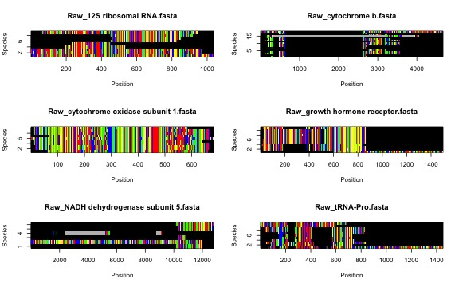
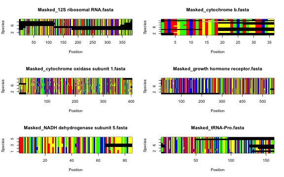

# Table of Contents

1.  [To export or not export from `phruta`](#intro)
2.  [From taxonomic names to sequence alignments, exporting](#paragraph1)

## To export or not export from `phruta` <a name="intro"></a>

Assembling a molecular dataset for particular target taxa with `phruta` can be performed almost entirely by saving objects into your workspace. This topic was covered in the introductory vignette to `phruta` (Using the `phruta` R package). However, in some situations, it might be desirable to save the outputs of different `phruta` functions to particular folders. This tutorial will cover that specific situation. Specifically, we will be reviewing how `phruta` can be used to export `.fasta` and `.csv` files that are generated in different steps of the pipeline.

## From taxonomic names to sequence alignments, exporting data <a name="paragraph1"></a>

In the introductory vignette to `phruta` (Using the `phruta` R package), we assembled a basic molecular dataset for inferring the phylogeny among three mammal genera. Let's recreate the same tutorial, but in this case, exporting the intermediate files that are created after using several of the functions. Note that the structure of this tutorial closely follows that of "Using the `phruta` `R` package". You should be able to follow this tutorial even without having reviewed the introductory vignette.

Please assume that we are interested in building a phylogenetic tree for the following three genera: *Felis, Vulpes*, and *Phoca*. All these three genera are classified within the Carnivora, a mammalian order. Both *Felis* and *Vulpes* are classified in different superfamilies within the Fissipedia. Finally, *Phoca* is part of another suborder, Pinnipedia. We're going to root our tree with another mammal species, a Chinese Pangolin (*Manis pentadactyla*). Users can select additional target species and clades. However, for simplicity, we will run the analyses using three genera in the ingroup and a single outgroup species.

So far, we have decided the taxonomic make of our analyses in `phruta`. We will also need to determine the gene regions to be used in our analyses. Fortunately, mammals are extensively studied and a comprehensive list of potential gene regions to be analyzed is already available. For instance, we could use same gene regions sampled in [Upham et al (2009)](https://journals.plos.org/plosbiology/article?id=10.1371/journal.pbio.3000494#sec030). However, for this tutorial, we will simply try to find the gene regions are well sampled for the target taxa. I believe that figuring out the best sampled gene regions in genbank, instead of providing gene names, is potentially more valuable when working with poorly studied groups (e.g. invertebrates). Before we move on, please make sure that you you have [set a working directory for this project](http://rfunction.com/archives/1001). All the files will be saved to this directory. `phruta` will politely ask before writing files to your local directories.

Let's start by loading `phruta`!


```r
library(phruta)
```


Now, let's look for the gene regions that are sampled for our target taxa. Again, this step is not always necessary. In some groups, gene-level sampling is very standard (e.g. COI, 12S). However, the structure of gene sampling sometimes becomes more blurry as you zoom out taxonomically. For instance, genes A and B can be extensively sampled in genus 1. However, genus 2 in the same family has mainly been studied using genes Y and Z. The idea here is that `phruta` will try to find those gene regions that are extensively sampled across species in the target taxa. We will use the `gene.sampling.retrieve()` function in `phruta`. The resulting `data.frame`, named `gs.seqs` in this example, will contain the list of full names for genes sampled in genbank for the target taxa.


```r
gs.seqs <- gene.sampling.retrieve(organism = c("Felis", "Vulpes", "Phoca", "Manis_pentadactyla"), 
                                  speciesSampling = TRUE)
```

For the search terms used above, `phruta` was able to retrieve the names for 1594 gene regions. In the table below I summarize a few of those genes, with sampling frequency calculated at the level of species (see `speciesSampling = TRUE` argument above).


Table: Gene sampling for the search including the genera Felis, Vulpes, Phoca as the ingroup taxa. Manis pentadactyla was used as outgroup.

|Gene                                        | Sampled in N species| PercentOfSampledSpecies|
|:-------------------------------------------|--------------------:|-----------------------:|
|cytochrome b                                |                   25|                75.75758|
|NADH dehydrogenase subunit 5                |                   14|                42.42424|
|12S ribosomal RNA                           |                   11|                33.33333|
|cytochrome oxidase subunit 1                |                   11|                33.33333|
|growth hormone receptor                     |                   11|                33.33333|
|interphotoreceptor retinoid-binding protein |                   10|                30.30303|

Thus, the `gene.sampling.retrieve()` function provides an estimate of the number of species in genbank that matches the taxonomic criteria and have sequences for a given gene region. Note that the estimates recovered by `gene.sampling.retrieve()` are only as good as the annotations that other researchers have provided for sequences deposited in genbank.

From here, we will generate a preliminary table summarizing accession numbers for the combination of taxa and gene regions that we're interested in sampling. However, note that not all these accession numbers are expected to be in the final (curated) molecular dataset. For instance, several sequences might be dropped later after taxonomic information is curated. Now, we will assemble a species-level summary of accession numbers using the `acc.table.retrieve()` function. For simplicity, this tutorial will focus on sampling gene regions that are sampled in \>30% of the species (`targetGenes` `data.frame`).


```r
targetGenes <- gs.seqs[gs.seqs$PercentOfSampledSpecies > 30,]

acc.table <- acc.table.retrieve(
            clades  = c('Felis', 'Vulpes', 'Phoca'),
            species = 'Manis_pentadactyla' ,
            genes   = targetGenes$Gene,
            speciesLevel = TRUE
          )
```

The `acc.table` object is a `data.frame` that will be used below for downloading the relevant gene sequences. In this case, the dataset includes the following information:


Table: Accession numbers for the relevant species and gene regions examined in this tutorial.

|Species                      |Ti                                                                                                                                                                                                                                                                                                                                                                                                                                                                                              |Acc      |gene                                        |
|:----------------------------|:-----------------------------------------------------------------------------------------------------------------------------------------------------------------------------------------------------------------------------------------------------------------------------------------------------------------------------------------------------------------------------------------------------------------------------------------------------------------------------------------------|:--------|:-------------------------------------------|
|Felis silvestris             |Felis silvestris silvestris isolate FS_101 NADH dehydrogenase subunit 5 (ND5) gene, partial cds; NADH dehydrogenase subunit 6 (ND6) gene, complete cds; tRNA-Glu gene, complete sequence; and cytochrome b (cytb) gene, partial cds; mitochondrial                                                                                                                                                                                                                                              |OL654361 |cytochrome b                                |
|Felis catus                  |Felis catus MKRaS008 mitochondrial gene for cytochrome b, partial cds                                                                                                                                                                                                                                                                                                                                                                                                                           |LC649705 |cytochrome b                                |
|Felis chaus                  |Felis chaus isolate Jungle Cat 5 cytochrome b (cytb) gene, partial cds; mitochondrial                                                                                                                                                                                                                                                                                                                                                                                                           |MN370575 |cytochrome b                                |
|Felis environmental          |Felis environmental sample isolate Kw-170 cytochrome b (cytb) gene, partial cds; mitochondrial                                                                                                                                                                                                                                                                                                                                                                                                  |MK510873 |cytochrome b                                |
|Felis margarita              |Felis margarita haplotype AH NADH dehydrogenase subunit 5 (ND5) and cytochrome b (cytb) genes, partial cds; and tRNA-Thr gene and D-loop, partial sequence; mitochondrial                                                                                                                                                                                                                                                                                                                       |MK606132 |cytochrome b                                |
|Felis bieti                  |Felis bieti cytochrome b gene, partial cds; mitochondrial                                                                                                                                                                                                                                                                                                                                                                                                                                       |AY773081 |cytochrome b                                |
|F.domesticus mitochondrial   |F.domesticus mitochondrial cytochrome b gene                                                                                                                                                                                                                                                                                                                                                                                                                                                    |X82296   |cytochrome b                                |
|Vulpes vulpes                |Vulpes vulpes isolate LH198 haplotype FOX14 cytochrome b (CYTB) gene, partial cds; mitochondrial                                                                                                                                                                                                                                                                                                                                                                                                |MK244493 |cytochrome b                                |
|Vulpes corsac                |Vulpes corsac isolate SH21 cytochrome b (CYTB) gene, complete cds; mitochondrial                                                                                                                                                                                                                                                                                                                                                                                                                |MT795179 |cytochrome b                                |
|Vulpes zerda                 |Vulpes zerda isolate X161349 cytochrome b (Cytb) gene, partial cds; mitochondrial                                                                                                                                                                                                                                                                                                                                                                                                               |MH854561 |cytochrome b                                |
|Vulpes cana                  |Vulpes cana isolate B.F.Y3 cytochrome b (cytb) gene, partial cds; mitochondrial                                                                                                                                                                                                                                                                                                                                                                                                                 |KU378587 |cytochrome b                                |
|Vulpes rueppellii            |Vulpes rueppellii isolate R.F.Y6 cytochrome b (cytb) gene, partial cds; mitochondrial                                                                                                                                                                                                                                                                                                                                                                                                           |KU378373 |cytochrome b                                |
|Vulpes lagopus               |Vulpes lagopus haplotype 5 cytochrome b (cytb) gene, partial cds; mitochondrial                                                                                                                                                                                                                                                                                                                                                                                                                 |KX093945 |cytochrome b                                |
|Vulpes ferrilata             |Vulpes ferrilata haplotype 1 cytochrome b (cytb) gene, partial cds; mitochondrial                                                                                                                                                                                                                                                                                                                                                                                                               |EU872065 |cytochrome b                                |
|Vulpes macrotis              |Vulpes macrotis cytochrome b (cytb) gene, mitochondrial gene encoding mitochondrial protein, partial cds                                                                                                                                                                                                                                                                                                                                                                                        |AF028157 |cytochrome b                                |
|Vulpes pallida               |Vulpes pallida haplotype PMa2 cytochrome b (cytb) gene, partial cds; mitochondrial                                                                                                                                                                                                                                                                                                                                                                                                              |KJ597964 |cytochrome b                                |
|V.vulpes mitochondrial       |V.vulpes mitochondrial DNA for cytochrome b (complete sequence)                                                                                                                                                                                                                                                                                                                                                                                                                                 |X94929   |cytochrome b                                |
|Phoca largha                 |Phoca largha PLCBRe4 mitochondrial cytb gene for cytochrome b, partial cds                                                                                                                                                                                                                                                                                                                                                                                                                      |LC466149 |cytochrome b                                |
|Pagophilus groenlandicus     |Pagophilus groenlandicus cytochrome b gene, partial cds; mitochondrial gene for mitochondrial product                                                                                                                                                                                                                                                                                                                                                                                           |AF200491 |cytochrome b                                |
|Phoca groenlandica           |Phoca groenlandica cytochrome b (cytb) gene, complete cds; mitochondrial                                                                                                                                                                                                                                                                                                                                                                                                                        |GU174609 |cytochrome b                                |
|Phoca fasciata               |Phoca fasciata cytochrome b (cytb) gene, complete cds; mitochondrial                                                                                                                                                                                                                                                                                                                                                                                                                            |GU167294 |cytochrome b                                |
|Phoca vitulina               |Phoca vitulina mitochondrial cytochrome b gene, partial cds                                                                                                                                                                                                                                                                                                                                                                                                                                     |L19127   |cytochrome b                                |
|P.vitulina mitochondrial     |P.vitulina mitochondrial cytochrome b gene                                                                                                                                                                                                                                                                                                                                                                                                                                                      |X82306   |cytochrome b                                |
|P.largha mitochondrial       |P.largha mitochondrial cytochrome b gene                                                                                                                                                                                                                                                                                                                                                                                                                                                        |X82305   |cytochrome b                                |
|P.groenlandica mitochondrial |P.groenlandica mitochondrial cytochrome b gene                                                                                                                                                                                                                                                                                                                                                                                                                                                  |X82303   |cytochrome b                                |
|P.fasciata mitochondrial     |P.fasciata mitochondrial cytochrome b gene                                                                                                                                                                                                                                                                                                                                                                                                                                                      |X82302   |cytochrome b                                |
|Manis pentadactyla           |Manis pentadactyla isolate ST08 cytochrome b (cytb) gene, partial cds; mitochondrial                                                                                                                                                                                                                                                                                                                                                                                                            |MW197469 |cytochrome b                                |
|Felis silvestris             |Felis silvestris silvestris isolate FS_101 NADH dehydrogenase subunit 5 (ND5) gene, partial cds; NADH dehydrogenase subunit 6 (ND6) gene, complete cds; tRNA-Glu gene, complete sequence; and cytochrome b (cytb) gene, partial cds; mitochondrial                                                                                                                                                                                                                                              |OL654361 |NADH dehydrogenase subunit 5                |
|Felis catus                  |Felis catus isolate 4709-K NADH dehydrogenase subunit 5 (ND5) gene, partial cds; NADH dehydrogenase subunit 6 (ND6) gene, complete cds; tRNA-Glu gene, complete sequence; and cytochrome b (CYTB) gene, partial cds; mitochondrial                                                                                                                                                                                                                                                              |MN313781 |NADH dehydrogenase subunit 5                |
|Felis margarita              |Felis margarita haplotype AH NADH dehydrogenase subunit 5 (ND5) and cytochrome b (cytb) genes, partial cds; and tRNA-Thr gene and D-loop, partial sequence; mitochondrial                                                                                                                                                                                                                                                                                                                       |MK606132 |NADH dehydrogenase subunit 5                |
|Felis chaus                  |Felis chaus isolate JCAIZ003 NADH dehydrogenase subunit 5 (ND5) gene, partial cds; mitochondrial                                                                                                                                                                                                                                                                                                                                                                                                |GU561700 |NADH dehydrogenase subunit 5                |
|Vulpes lagopus               |Vulpes lagopus ATP synthase F0 subunit 6 (ATP6), ATP synthase F0 subunit 8 (ATP8), cytochrome c oxidase subunit I (COX1), cytochrome c oxidase subunit II (COX2), cytochrome c oxidase subunit III (COX3), cytochrome b (CYTB), NADH dehydrogenase subunit 1 (ND1), NADH dehydrogenase subunit 2 (ND2), NADH dehydrogenase subunit 3 (ND3), NADH dehydrogenase subunit 4 (ND4), NADH dehydrogenase subunit 4L (ND4L), and NADH dehydrogenase subunit 5 (ND5) genes, complete cds; mitochondrial |AH014073 |NADH dehydrogenase subunit 5                |
|Phoca groenlandica           |Phoca groenlandica NADH dehydrogenase subunit 5 (ND5) gene, complete cds; mitochondrial gene for mitochondrial product                                                                                                                                                                                                                                                                                                                                                                          |AY377376 |NADH dehydrogenase subunit 5                |
|Phoca fasciata               |Phoca fasciata NADH dehydrogenase subunit 5 (ND5) gene, complete cds; mitochondrial                                                                                                                                                                                                                                                                                                                                                                                                             |GU167331 |NADH dehydrogenase subunit 5                |
|Felis catus                  |Felis catus voucher N22b 12S ribosomal RNA gene, partial sequence; mitochondrial                                                                                                                                                                                                                                                                                                                                                                                                                |KX786344 |12S ribosomal RNA                           |
|Felis chaus                  |Felis chaus isolate G 12S ribosomal RNA gene, partial sequence; mitochondrial                                                                                                                                                                                                                                                                                                                                                                                                                   |KU963205 |12S ribosomal RNA                           |
|Felis silvestris             |Felis silvestris 12S ribosomal RNA gene, partial sequence; mitochondrial                                                                                                                                                                                                                                                                                                                                                                                                                        |KX002032 |12S ribosomal RNA                           |
|Felis bieti                  |Felis bieti 12S ribosomal RNA gene, partial sequence; mitochondrial                                                                                                                                                                                                                                                                                                                                                                                                                             |AY773084 |12S ribosomal RNA                           |
|Vulpes vulpes                |Vulpes vulpes Vv1 mitochondrial gene for 12S ribosomal RNA, partial sequence                                                                                                                                                                                                                                                                                                                                                                                                                    |LC424764 |12S ribosomal RNA                           |
|Vulpes lagopus               |Vulpes lagopus isolate FRT12 12S ribosomal RNA gene, partial sequence; mitochondrial                                                                                                                                                                                                                                                                                                                                                                                                            |KM224240 |12S ribosomal RNA                           |
|Phoca fasciata               |Phoca fasciata isolate 5888 12S ribosomal RNA gene, partial sequence; mitochondrial                                                                                                                                                                                                                                                                                                                                                                                                             |GU174595 |12S ribosomal RNA                           |
|Phoca largha                 |Phoca largha isolate 06spotted03 12S ribosomal RNA gene, partial sequence; mitochondrial                                                                                                                                                                                                                                                                                                                                                                                                        |GU174591 |12S ribosomal RNA                           |
|Manis pentadactyla           |Manis pentadactyla 12S ribosomal RNA gene, partial sequence; and tRNA-Val gene, complete sequence; mitochondrial                                                                                                                                                                                                                                                                                                                                                                                |AY012154 |12S ribosomal RNA                           |
|Felis catus                  |Felis catus voucher Cat_KU cytochrome oxidase subunit 1 (COI) gene, partial cds; mitochondrial                                                                                                                                                                                                                                                                                                                                                                                                  |MN124254 |cytochrome oxidase subunit 1                |
|Felis nigripes               |Felis nigripes voucher NZG:BWP38761 cytochrome oxidase subunit 1 (COI) gene, partial cds; mitochondrial                                                                                                                                                                                                                                                                                                                                                                                         |KX012677 |cytochrome oxidase subunit 1                |
|Felis margarita              |Felis margarita voucher 198_Fe_mar cytochrome oxidase subunit 1 (COI) gene, partial cds; mitochondrial                                                                                                                                                                                                                                                                                                                                                                                          |KF297765 |cytochrome oxidase subunit 1                |
|Vulpes vulpes                |Vulpes vulpes voucher BIOUG<CAN>:HBL008452 cytochrome oxidase subunit 1 (COI) gene, partial cds; mitochondrial                                                                                                                                                                                                                                                                                                                                                                                  |JF443560 |cytochrome oxidase subunit 1                |
|Vulpes chama                 |Vulpes chama voucher NZG:BWP38701 cytochrome oxidase subunit 1 (COI) gene, partial cds; mitochondrial                                                                                                                                                                                                                                                                                                                                                                                           |KX012672 |cytochrome oxidase subunit 1                |
|Vulpes lagopus               |Vulpes lagopus voucher HBL008485 cytochrome oxidase subunit 1 (COI) gene, partial cds; mitochondrial                                                                                                                                                                                                                                                                                                                                                                                            |JF443554 |cytochrome oxidase subunit 1                |
|Vulpes velox                 |Vulpes velox voucher ROM 105399 cytochrome oxidase subunit 1 (COI) gene, partial cds; mitochondrial                                                                                                                                                                                                                                                                                                                                                                                             |JF443557 |cytochrome oxidase subunit 1                |
|Phoca vitulina               |Phoca vitulina voucher HBL008389 cytochrome oxidase subunit 1 (COI) gene, partial cds; mitochondrial                                                                                                                                                                                                                                                                                                                                                                                            |JF443364 |cytochrome oxidase subunit 1                |
|Phoca largha                 |Phoca largha voucher HBL008423 cytochrome oxidase subunit 1 (COI) gene, partial cds; mitochondrial                                                                                                                                                                                                                                                                                                                                                                                              |JF443363 |cytochrome oxidase subunit 1                |
|Phoca groenlandica           |Phoca groenlandica voucher HBL008364 cytochrome oxidase subunit 1 (COI) gene, partial cds; mitochondrial                                                                                                                                                                                                                                                                                                                                                                                        |JF443362 |cytochrome oxidase subunit 1                |
|Manis pentadactyla           |Manis pentadactyla isolate KFBG_HZ0050 cytochrome oxidase subunit 1 gene, partial cds; mitochondrial                                                                                                                                                                                                                                                                                                                                                                                            |KT428152 |cytochrome oxidase subunit 1                |
|Felis catus                  |Felis catus growth hormone receptor (GHR) gene, partial cds                                                                                                                                                                                                                                                                                                                                                                                                                                     |DQ205829 |growth hormone receptor                     |
|Vulpes vulpes                |Vulpes vulpes growth hormone receptor gene, exon 10 and partial cds                                                                                                                                                                                                                                                                                                                                                                                                                             |AY885401 |growth hormone receptor                     |
|Vulpes macrotis              |Vulpes macrotis growth hormone receptor gene, exon 10 and partial cds                                                                                                                                                                                                                                                                                                                                                                                                                           |AY885400 |growth hormone receptor                     |
|Vulpes corsac                |Vulpes corsac growth hormone receptor gene, exon 10 and partial cds                                                                                                                                                                                                                                                                                                                                                                                                                             |AY885399 |growth hormone receptor                     |
|Vulpes zerda                 |Vulpes zerda growth hormone receptor gene, exon 10 and partial cds                                                                                                                                                                                                                                                                                                                                                                                                                              |AY885393 |growth hormone receptor                     |
|Alopex lagopus               |Alopex lagopus growth hormone receptor gene, exon 10 and partial cds                                                                                                                                                                                                                                                                                                                                                                                                                            |AY885379 |growth hormone receptor                     |
|Vulpes velox                 |Vulpes velox growth hormone receptor (GHR) gene, partial cds                                                                                                                                                                                                                                                                                                                                                                                                                                    |DQ205838 |growth hormone receptor                     |
|Vulpes lagopus               |Vulpes lagopus growth hormone receptor (GHR) gene, partial cds                                                                                                                                                                                                                                                                                                                                                                                                                                  |DQ205837 |growth hormone receptor                     |
|Phoca vitulina               |Phoca vitulina growth hormone receptor (GHR) gene, partial cds                                                                                                                                                                                                                                                                                                                                                                                                                                  |GU931127 |growth hormone receptor                     |
|Phoca largha                 |Phoca largha growth hormone receptor (GHR) gene, partial cds                                                                                                                                                                                                                                                                                                                                                                                                                                    |DQ205827 |growth hormone receptor                     |
|Phoca groenlandica           |Phoca groenlandica growth hormone receptor (GHR) gene, partial cds                                                                                                                                                                                                                                                                                                                                                                                                                              |DQ205825 |growth hormone receptor                     |
|Manis pentadactyla           |Manis pentadactyla growth hormone receptor (GHR) gene, exon 10 and partial cds                                                                                                                                                                                                                                                                                                                                                                                                                  |EU448992 |growth hormone receptor                     |
|Felis catus                  |Felis catus interphotoreceptor retinoid binding protein gene, exon 1                                                                                                                                                                                                                                                                                                                                                                                                                            |Z11811   |interphotoreceptor retinoid-binding protein |
|Vulpes velox                 |Vulpes velox interphotoreceptor retinoid binding protein gene, partial cds                                                                                                                                                                                                                                                                                                                                                                                                                      |AF179293 |interphotoreceptor retinoid-binding protein |
|Manis pentadactyla           |Manis pentadactyla interphotoreceptor retinoid binding protein (IRBP) gene, exon 1 and partial cds                                                                                                                                                                                                                                                                                                                                                                                              |JN414784 |interphotoreceptor retinoid-binding protein |
|Felis silvestris             |Felis silvestris haplotype W23 tRNA-Pro gene and control region, partial sequence; mitochondrial                                                                                                                                                                                                                                                                                                                                                                                                |MF353436 |tRNA-Pro                                    |
|Felis catus                  |Felis catus mitochondrial tRNA-Pro gene and control region, partial sequence                                                                                                                                                                                                                                                                                                                                                                                                                    |AF348642 |tRNA-Pro                                    |
|Vulpes vulpes                |Vulpes vulpes isolate VvUAE056 tRNA-Thr gene, partial sequence; tRNA-Pro gene, complete sequence; and D-loop, partial sequence; mitochondrial                                                                                                                                                                                                                                                                                                                                                   |MT955893 |tRNA-Pro                                    |
|Vulpes rueppellii            |Vulpes rueppellii isolate VrKSAA0005 tRNA-Thr gene, partial sequence; tRNA-Pro gene, complete sequence; and D-loop, partial sequence; mitochondrial                                                                                                                                                                                                                                                                                                                                             |MT955814 |tRNA-Pro                                    |
|Vulpes lagopus               |Vulpes lagopus haplotype H11 tRNA-Pro gene and D-loop, partial sequence; mitochondrial                                                                                                                                                                                                                                                                                                                                                                                                          |KX093931 |tRNA-Pro                                    |
|Vulpes macrotis              |Vulpes macrotis haplotype Vmac1 tRNA-Pro gene and D-loop, partial sequence; mitochondrial                                                                                                                                                                                                                                                                                                                                                                                                       |KJ846673 |tRNA-Pro                                    |
|Vulpes zerda                 |Vulpes zerda haplotype Vzer1 tRNA-Pro gene and D-loop, partial sequence; mitochondrial                                                                                                                                                                                                                                                                                                                                                                                                          |KJ846672 |tRNA-Pro                                    |
|Vulpes ferrilata             |Vulpes ferrilata haplotype 4 D-loop, partial sequence; tRNA-Pro gene, complete sequence; and tRNA-Thr gene, partial sequence; mitochondrial                                                                                                                                                                                                                                                                                                                                                     |JF520840 |tRNA-Pro                                    |
|Phoca largha                 |Phoca largha isolate pl27 tRNA-Thr gene, partial sequence; tRNA-Pro gene, complete sequence; and D-loop, partial sequence; mitochondrial                                                                                                                                                                                                                                                                                                                                                        |OM967017 |tRNA-Pro                                    |
|Phoca vitulina               |Phoca vitulina isolate N tRNA-Thr (trnT) gene, partial sequence; tRNA-Pro (trnP) gene, complete sequence; and D-loop, partial sequence; mitochondrial                                                                                                                                                                                                                                                                                                                                           |HQ702987 |tRNA-Pro                                    |
|Manis pentadactyla           |Manis pentadactyla pentadactyla isolate MPP5 tRNA-Pro gene, partial sequence; D-loop, complete sequence; and tRNA-Phe gene, partial sequence; mitochondrial                                                                                                                                                                                                                                                                                                                                     |GQ232081 |tRNA-Pro                                    |

Feel free to review this dataset, make changes, add new species, samples, etc. The integrity of this dataset is critical for the next steps so please take your time and review it carefully. For instance, let's just make some minor changes to our dataset:


```r
acc.table$Species <- sub("P.", "Phoca ", acc.table$Species, fixed = TRUE)
acc.table$Species <- sub("F.", "Felis ", acc.table$Species, fixed = TRUE)
acc.table$Species <- sub("V.", "Vulpes ", acc.table$Species, fixed = TRUE)
acc.table$Species <- sub("mitochondrial", "", acc.table$Species)
row.names(acc.table) <- NULL
```

Let's check how the new table looks now...


Table: Updated Table 2 with some minor corrections on species names. Other updates to this table include adding more sequences, using specific sequences (instead of the ones suggested by `phruta`).

|Species                  |Ti                                                                                                                                                                                                                                                                                                                                                                                                                                                                                              |Acc      |gene                                        |
|:------------------------|:-----------------------------------------------------------------------------------------------------------------------------------------------------------------------------------------------------------------------------------------------------------------------------------------------------------------------------------------------------------------------------------------------------------------------------------------------------------------------------------------------|:--------|:-------------------------------------------|
|Felis silvestris         |Felis silvestris silvestris isolate FS_101 NADH dehydrogenase subunit 5 (ND5) gene, partial cds; NADH dehydrogenase subunit 6 (ND6) gene, complete cds; tRNA-Glu gene, complete sequence; and cytochrome b (cytb) gene, partial cds; mitochondrial                                                                                                                                                                                                                                              |OL654361 |cytochrome b                                |
|Felis catus              |Felis catus MKRaS008 mitochondrial gene for cytochrome b, partial cds                                                                                                                                                                                                                                                                                                                                                                                                                           |LC649705 |cytochrome b                                |
|Felis chaus              |Felis chaus isolate Jungle Cat 5 cytochrome b (cytb) gene, partial cds; mitochondrial                                                                                                                                                                                                                                                                                                                                                                                                           |MN370575 |cytochrome b                                |
|Felis environmental      |Felis environmental sample isolate Kw-170 cytochrome b (cytb) gene, partial cds; mitochondrial                                                                                                                                                                                                                                                                                                                                                                                                  |MK510873 |cytochrome b                                |
|Felis margarita          |Felis margarita haplotype AH NADH dehydrogenase subunit 5 (ND5) and cytochrome b (cytb) genes, partial cds; and tRNA-Thr gene and D-loop, partial sequence; mitochondrial                                                                                                                                                                                                                                                                                                                       |MK606132 |cytochrome b                                |
|Felis bieti              |Felis bieti cytochrome b gene, partial cds; mitochondrial                                                                                                                                                                                                                                                                                                                                                                                                                                       |AY773081 |cytochrome b                                |
|Felis domesticus         |F.domesticus mitochondrial cytochrome b gene                                                                                                                                                                                                                                                                                                                                                                                                                                                    |X82296   |cytochrome b                                |
|Vulpes vulpes            |Vulpes vulpes isolate LH198 haplotype FOX14 cytochrome b (CYTB) gene, partial cds; mitochondrial                                                                                                                                                                                                                                                                                                                                                                                                |MK244493 |cytochrome b                                |
|Vulpes corsac            |Vulpes corsac isolate SH21 cytochrome b (CYTB) gene, complete cds; mitochondrial                                                                                                                                                                                                                                                                                                                                                                                                                |MT795179 |cytochrome b                                |
|Vulpes zerda             |Vulpes zerda isolate X161349 cytochrome b (Cytb) gene, partial cds; mitochondrial                                                                                                                                                                                                                                                                                                                                                                                                               |MH854561 |cytochrome b                                |
|Vulpes cana              |Vulpes cana isolate B.F.Y3 cytochrome b (cytb) gene, partial cds; mitochondrial                                                                                                                                                                                                                                                                                                                                                                                                                 |KU378587 |cytochrome b                                |
|Vulpes rueppellii        |Vulpes rueppellii isolate R.F.Y6 cytochrome b (cytb) gene, partial cds; mitochondrial                                                                                                                                                                                                                                                                                                                                                                                                           |KU378373 |cytochrome b                                |
|Vulpes lagopus           |Vulpes lagopus haplotype 5 cytochrome b (cytb) gene, partial cds; mitochondrial                                                                                                                                                                                                                                                                                                                                                                                                                 |KX093945 |cytochrome b                                |
|Vulpes ferrilata         |Vulpes ferrilata haplotype 1 cytochrome b (cytb) gene, partial cds; mitochondrial                                                                                                                                                                                                                                                                                                                                                                                                               |EU872065 |cytochrome b                                |
|Vulpes macrotis          |Vulpes macrotis cytochrome b (cytb) gene, mitochondrial gene encoding mitochondrial protein, partial cds                                                                                                                                                                                                                                                                                                                                                                                        |AF028157 |cytochrome b                                |
|Vulpes pallida           |Vulpes pallida haplotype PMa2 cytochrome b (cytb) gene, partial cds; mitochondrial                                                                                                                                                                                                                                                                                                                                                                                                              |KJ597964 |cytochrome b                                |
|Vulpes vulpes            |V.vulpes mitochondrial DNA for cytochrome b (complete sequence)                                                                                                                                                                                                                                                                                                                                                                                                                                 |X94929   |cytochrome b                                |
|Phoca largha             |Phoca largha PLCBRe4 mitochondrial cytb gene for cytochrome b, partial cds                                                                                                                                                                                                                                                                                                                                                                                                                      |LC466149 |cytochrome b                                |
|Pagophilus groenlandicus |Pagophilus groenlandicus cytochrome b gene, partial cds; mitochondrial gene for mitochondrial product                                                                                                                                                                                                                                                                                                                                                                                           |AF200491 |cytochrome b                                |
|Phoca groenlandica       |Phoca groenlandica cytochrome b (cytb) gene, complete cds; mitochondrial                                                                                                                                                                                                                                                                                                                                                                                                                        |GU174609 |cytochrome b                                |
|Phoca fasciata           |Phoca fasciata cytochrome b (cytb) gene, complete cds; mitochondrial                                                                                                                                                                                                                                                                                                                                                                                                                            |GU167294 |cytochrome b                                |
|Phoca vitulina           |Phoca vitulina mitochondrial cytochrome b gene, partial cds                                                                                                                                                                                                                                                                                                                                                                                                                                     |L19127   |cytochrome b                                |
|Phoca vitulina           |P.vitulina mitochondrial cytochrome b gene                                                                                                                                                                                                                                                                                                                                                                                                                                                      |X82306   |cytochrome b                                |
|Phoca largha             |P.largha mitochondrial cytochrome b gene                                                                                                                                                                                                                                                                                                                                                                                                                                                        |X82305   |cytochrome b                                |
|Phoca groenlandica       |P.groenlandica mitochondrial cytochrome b gene                                                                                                                                                                                                                                                                                                                                                                                                                                                  |X82303   |cytochrome b                                |
|Phoca fasciata           |P.fasciata mitochondrial cytochrome b gene                                                                                                                                                                                                                                                                                                                                                                                                                                                      |X82302   |cytochrome b                                |
|Manis pentadactyla       |Manis pentadactyla isolate ST08 cytochrome b (cytb) gene, partial cds; mitochondrial                                                                                                                                                                                                                                                                                                                                                                                                            |MW197469 |cytochrome b                                |
|Felis silvestris         |Felis silvestris silvestris isolate FS_101 NADH dehydrogenase subunit 5 (ND5) gene, partial cds; NADH dehydrogenase subunit 6 (ND6) gene, complete cds; tRNA-Glu gene, complete sequence; and cytochrome b (cytb) gene, partial cds; mitochondrial                                                                                                                                                                                                                                              |OL654361 |NADH dehydrogenase subunit 5                |
|Felis catus              |Felis catus isolate 4709-K NADH dehydrogenase subunit 5 (ND5) gene, partial cds; NADH dehydrogenase subunit 6 (ND6) gene, complete cds; tRNA-Glu gene, complete sequence; and cytochrome b (CYTB) gene, partial cds; mitochondrial                                                                                                                                                                                                                                                              |MN313781 |NADH dehydrogenase subunit 5                |
|Felis margarita          |Felis margarita haplotype AH NADH dehydrogenase subunit 5 (ND5) and cytochrome b (cytb) genes, partial cds; and tRNA-Thr gene and D-loop, partial sequence; mitochondrial                                                                                                                                                                                                                                                                                                                       |MK606132 |NADH dehydrogenase subunit 5                |
|Felis chaus              |Felis chaus isolate JCAIZ003 NADH dehydrogenase subunit 5 (ND5) gene, partial cds; mitochondrial                                                                                                                                                                                                                                                                                                                                                                                                |GU561700 |NADH dehydrogenase subunit 5                |
|Vulpes lagopus           |Vulpes lagopus ATP synthase F0 subunit 6 (ATP6), ATP synthase F0 subunit 8 (ATP8), cytochrome c oxidase subunit I (COX1), cytochrome c oxidase subunit II (COX2), cytochrome c oxidase subunit III (COX3), cytochrome b (CYTB), NADH dehydrogenase subunit 1 (ND1), NADH dehydrogenase subunit 2 (ND2), NADH dehydrogenase subunit 3 (ND3), NADH dehydrogenase subunit 4 (ND4), NADH dehydrogenase subunit 4L (ND4L), and NADH dehydrogenase subunit 5 (ND5) genes, complete cds; mitochondrial |AH014073 |NADH dehydrogenase subunit 5                |
|Phoca groenlandica       |Phoca groenlandica NADH dehydrogenase subunit 5 (ND5) gene, complete cds; mitochondrial gene for mitochondrial product                                                                                                                                                                                                                                                                                                                                                                          |AY377376 |NADH dehydrogenase subunit 5                |
|Phoca fasciata           |Phoca fasciata NADH dehydrogenase subunit 5 (ND5) gene, complete cds; mitochondrial                                                                                                                                                                                                                                                                                                                                                                                                             |GU167331 |NADH dehydrogenase subunit 5                |
|Felis catus              |Felis catus voucher N22b 12S ribosomal RNA gene, partial sequence; mitochondrial                                                                                                                                                                                                                                                                                                                                                                                                                |KX786344 |12S ribosomal RNA                           |
|Felis chaus              |Felis chaus isolate G 12S ribosomal RNA gene, partial sequence; mitochondrial                                                                                                                                                                                                                                                                                                                                                                                                                   |KU963205 |12S ribosomal RNA                           |
|Felis silvestris         |Felis silvestris 12S ribosomal RNA gene, partial sequence; mitochondrial                                                                                                                                                                                                                                                                                                                                                                                                                        |KX002032 |12S ribosomal RNA                           |
|Felis bieti              |Felis bieti 12S ribosomal RNA gene, partial sequence; mitochondrial                                                                                                                                                                                                                                                                                                                                                                                                                             |AY773084 |12S ribosomal RNA                           |
|Vulpes vulpes            |Vulpes vulpes Vv1 mitochondrial gene for 12S ribosomal RNA, partial sequence                                                                                                                                                                                                                                                                                                                                                                                                                    |LC424764 |12S ribosomal RNA                           |
|Vulpes lagopus           |Vulpes lagopus isolate FRT12 12S ribosomal RNA gene, partial sequence; mitochondrial                                                                                                                                                                                                                                                                                                                                                                                                            |KM224240 |12S ribosomal RNA                           |
|Phoca fasciata           |Phoca fasciata isolate 5888 12S ribosomal RNA gene, partial sequence; mitochondrial                                                                                                                                                                                                                                                                                                                                                                                                             |GU174595 |12S ribosomal RNA                           |
|Phoca largha             |Phoca largha isolate 06spotted03 12S ribosomal RNA gene, partial sequence; mitochondrial                                                                                                                                                                                                                                                                                                                                                                                                        |GU174591 |12S ribosomal RNA                           |
|Manis pentadactyla       |Manis pentadactyla 12S ribosomal RNA gene, partial sequence; and tRNA-Val gene, complete sequence; mitochondrial                                                                                                                                                                                                                                                                                                                                                                                |AY012154 |12S ribosomal RNA                           |
|Felis catus              |Felis catus voucher Cat_KU cytochrome oxidase subunit 1 (COI) gene, partial cds; mitochondrial                                                                                                                                                                                                                                                                                                                                                                                                  |MN124254 |cytochrome oxidase subunit 1                |
|Felis nigripes           |Felis nigripes voucher NZG:BWP38761 cytochrome oxidase subunit 1 (COI) gene, partial cds; mitochondrial                                                                                                                                                                                                                                                                                                                                                                                         |KX012677 |cytochrome oxidase subunit 1                |
|Felis margarita          |Felis margarita voucher 198_Fe_mar cytochrome oxidase subunit 1 (COI) gene, partial cds; mitochondrial                                                                                                                                                                                                                                                                                                                                                                                          |KF297765 |cytochrome oxidase subunit 1                |
|Vulpes vulpes            |Vulpes vulpes voucher BIOUG<CAN>:HBL008452 cytochrome oxidase subunit 1 (COI) gene, partial cds; mitochondrial                                                                                                                                                                                                                                                                                                                                                                                  |JF443560 |cytochrome oxidase subunit 1                |
|Vulpes chama             |Vulpes chama voucher NZG:BWP38701 cytochrome oxidase subunit 1 (COI) gene, partial cds; mitochondrial                                                                                                                                                                                                                                                                                                                                                                                           |KX012672 |cytochrome oxidase subunit 1                |
|Vulpes lagopus           |Vulpes lagopus voucher HBL008485 cytochrome oxidase subunit 1 (COI) gene, partial cds; mitochondrial                                                                                                                                                                                                                                                                                                                                                                                            |JF443554 |cytochrome oxidase subunit 1                |
|Vulpes velox             |Vulpes velox voucher ROM 105399 cytochrome oxidase subunit 1 (COI) gene, partial cds; mitochondrial                                                                                                                                                                                                                                                                                                                                                                                             |JF443557 |cytochrome oxidase subunit 1                |
|Phoca vitulina           |Phoca vitulina voucher HBL008389 cytochrome oxidase subunit 1 (COI) gene, partial cds; mitochondrial                                                                                                                                                                                                                                                                                                                                                                                            |JF443364 |cytochrome oxidase subunit 1                |
|Phoca largha             |Phoca largha voucher HBL008423 cytochrome oxidase subunit 1 (COI) gene, partial cds; mitochondrial                                                                                                                                                                                                                                                                                                                                                                                              |JF443363 |cytochrome oxidase subunit 1                |
|Phoca groenlandica       |Phoca groenlandica voucher HBL008364 cytochrome oxidase subunit 1 (COI) gene, partial cds; mitochondrial                                                                                                                                                                                                                                                                                                                                                                                        |JF443362 |cytochrome oxidase subunit 1                |
|Manis pentadactyla       |Manis pentadactyla isolate KFBG_HZ0050 cytochrome oxidase subunit 1 gene, partial cds; mitochondrial                                                                                                                                                                                                                                                                                                                                                                                            |KT428152 |cytochrome oxidase subunit 1                |
|Felis catus              |Felis catus growth hormone receptor (GHR) gene, partial cds                                                                                                                                                                                                                                                                                                                                                                                                                                     |DQ205829 |growth hormone receptor                     |
|Vulpes vulpes            |Vulpes vulpes growth hormone receptor gene, exon 10 and partial cds                                                                                                                                                                                                                                                                                                                                                                                                                             |AY885401 |growth hormone receptor                     |
|Vulpes macrotis          |Vulpes macrotis growth hormone receptor gene, exon 10 and partial cds                                                                                                                                                                                                                                                                                                                                                                                                                           |AY885400 |growth hormone receptor                     |
|Vulpes corsac            |Vulpes corsac growth hormone receptor gene, exon 10 and partial cds                                                                                                                                                                                                                                                                                                                                                                                                                             |AY885399 |growth hormone receptor                     |
|Vulpes zerda             |Vulpes zerda growth hormone receptor gene, exon 10 and partial cds                                                                                                                                                                                                                                                                                                                                                                                                                              |AY885393 |growth hormone receptor                     |
|Alopex lagopus           |Alopex lagopus growth hormone receptor gene, exon 10 and partial cds                                                                                                                                                                                                                                                                                                                                                                                                                            |AY885379 |growth hormone receptor                     |
|Vulpes velox             |Vulpes velox growth hormone receptor (GHR) gene, partial cds                                                                                                                                                                                                                                                                                                                                                                                                                                    |DQ205838 |growth hormone receptor                     |
|Vulpes lagopus           |Vulpes lagopus growth hormone receptor (GHR) gene, partial cds                                                                                                                                                                                                                                                                                                                                                                                                                                  |DQ205837 |growth hormone receptor                     |
|Phoca vitulina           |Phoca vitulina growth hormone receptor (GHR) gene, partial cds                                                                                                                                                                                                                                                                                                                                                                                                                                  |GU931127 |growth hormone receptor                     |
|Phoca largha             |Phoca largha growth hormone receptor (GHR) gene, partial cds                                                                                                                                                                                                                                                                                                                                                                                                                                    |DQ205827 |growth hormone receptor                     |
|Phoca groenlandica       |Phoca groenlandica growth hormone receptor (GHR) gene, partial cds                                                                                                                                                                                                                                                                                                                                                                                                                              |DQ205825 |growth hormone receptor                     |
|Manis pentadactyla       |Manis pentadactyla growth hormone receptor (GHR) gene, exon 10 and partial cds                                                                                                                                                                                                                                                                                                                                                                                                                  |EU448992 |growth hormone receptor                     |
|Felis catus              |Felis catus interphotoreceptor retinoid binding protein gene, exon 1                                                                                                                                                                                                                                                                                                                                                                                                                            |Z11811   |interphotoreceptor retinoid-binding protein |
|Vulpes velox             |Vulpes velox interphotoreceptor retinoid binding protein gene, partial cds                                                                                                                                                                                                                                                                                                                                                                                                                      |AF179293 |interphotoreceptor retinoid-binding protein |
|Manis pentadactyla       |Manis pentadactyla interphotoreceptor retinoid binding protein (IRBP) gene, exon 1 and partial cds                                                                                                                                                                                                                                                                                                                                                                                              |JN414784 |interphotoreceptor retinoid-binding protein |
|Felis silvestris         |Felis silvestris haplotype W23 tRNA-Pro gene and control region, partial sequence; mitochondrial                                                                                                                                                                                                                                                                                                                                                                                                |MF353436 |tRNA-Pro                                    |
|Felis catus              |Felis catus mitochondrial tRNA-Pro gene and control region, partial sequence                                                                                                                                                                                                                                                                                                                                                                                                                    |AF348642 |tRNA-Pro                                    |
|Vulpes vulpes            |Vulpes vulpes isolate VvUAE056 tRNA-Thr gene, partial sequence; tRNA-Pro gene, complete sequence; and D-loop, partial sequence; mitochondrial                                                                                                                                                                                                                                                                                                                                                   |MT955893 |tRNA-Pro                                    |
|Vulpes rueppellii        |Vulpes rueppellii isolate VrKSAA0005 tRNA-Thr gene, partial sequence; tRNA-Pro gene, complete sequence; and D-loop, partial sequence; mitochondrial                                                                                                                                                                                                                                                                                                                                             |MT955814 |tRNA-Pro                                    |
|Vulpes lagopus           |Vulpes lagopus haplotype H11 tRNA-Pro gene and D-loop, partial sequence; mitochondrial                                                                                                                                                                                                                                                                                                                                                                                                          |KX093931 |tRNA-Pro                                    |
|Vulpes macrotis          |Vulpes macrotis haplotype Vmac1 tRNA-Pro gene and D-loop, partial sequence; mitochondrial                                                                                                                                                                                                                                                                                                                                                                                                       |KJ846673 |tRNA-Pro                                    |
|Vulpes zerda             |Vulpes zerda haplotype Vzer1 tRNA-Pro gene and D-loop, partial sequence; mitochondrial                                                                                                                                                                                                                                                                                                                                                                                                          |KJ846672 |tRNA-Pro                                    |
|Vulpes ferrilata         |Vulpes ferrilata haplotype 4 D-loop, partial sequence; tRNA-Pro gene, complete sequence; and tRNA-Thr gene, partial sequence; mitochondrial                                                                                                                                                                                                                                                                                                                                                     |JF520840 |tRNA-Pro                                    |
|Phoca largha             |Phoca largha isolate pl27 tRNA-Thr gene, partial sequence; tRNA-Pro gene, complete sequence; and D-loop, partial sequence; mitochondrial                                                                                                                                                                                                                                                                                                                                                        |OM967017 |tRNA-Pro                                    |
|Phoca vitulina           |Phoca vitulina isolate N tRNA-Thr (trnT) gene, partial sequence; tRNA-Pro (trnP) gene, complete sequence; and D-loop, partial sequence; mitochondrial                                                                                                                                                                                                                                                                                                                                           |HQ702987 |tRNA-Pro                                    |
|Manis pentadactyla       |Manis pentadactyla pentadactyla isolate MPP5 tRNA-Pro gene, partial sequence; D-loop, complete sequence; and tRNA-Phe gene, partial sequence; mitochondrial                                                                                                                                                                                                                                                                                                                                     |GQ232081 |tRNA-Pro                                    |

Now, since we're going to retrieve sequences from genbank using an existing preliminary accession numbers table, we will use the `sq.retrieve.indirect()` function in `phruta`. I'm going to spend some time in here to explain the differences between the two versions of `sq.retrieve.*` in `phruta`. The one that we're using in this tutorial, `sq.retrieve.indirect()`, retrieves sequences "indirectly" because it follows the initial step of generating a table summarizing accession numbers (see the `acc.table.retrieve()` function above). I present the information in this vignette using `sq.retrieve.indirect()` instead of `sq.retrieve.direct()` because the first function is way more flexible and allows for correcting issues *prior* to download any sequence. For instance, you can add new sequences, species, populations to the resulting data.frame from `acc.table.retrieve()`. Additionally, you could even manually assemble your own dataset of accession numbers to be retrieved using `sq.retrieve.indirect()`. Instead, `sq.retrieve.direct()` does its best to directly (i.e. without potential input from the user) retrieve sequences for a target set of taxa and set of gene regions. In short, you should be able to catch errors using `sq.retrieve.indirect()` but mistakes will be harder to spot and fix if you're using `sq.retrieve.direct()`. Note that the functionality of `sq.retrieve.direct()` is outlined in the "Using `phruta` with defined target genes" vignette.

We still need to retrieve all the sequences from the accessions table that was generated avobe using `acc.table`. The `sq.retrieve.indirect()` function will write all the resulting `fasta` files into a newly created folder `0.Sequences` located in our working directory (please check the `download.sqs = TRUE` argument).


```r
sq.retrieve.indirect(acc.table, download.sqs = TRUE)
```

Next, we're going to make sure that we include only sequences that are reliable and from species that we are actually interested in analyzing. For this, we will be using the `sq.curate()` function. We need to provide a list of taxonomic names to filter out incorrect sequences (`filterTaxonomicCriteria` argument). For simplicity, our criteria can be the genera that we're interested in analyzing. Note that the outgroup's name should also be included in the list. If the taxonomic information for a sequence retrieved from genbank does not match with any of these strings, this species will be dropped. You will have to specify whether sampling is for animals or plants (`kingdom` argument). Finally, you might have already noticed that the same gene regions can have different names. For instance, sometimes our searches retrieve both "cytochrome oxidase subunit 1" and "cytochrome c oxidase subunit I" as widely sampled genes for the target species. In that case, we can combine the sequences in these two files into a single file name `COI`. To merge gene files, you will have to provide a named list to the `mergeGeneFiles` argument of the `sq.curate` function. This named list (`tb.merged` below) will have a length that corresponds to the number of final files that should be constructed.


```r
tb.merged <- list('COI' = c("cytochrome oxidase subunit 1", "cytochrome c oxidase subunit I"))
sq.curate(filterTaxonomicCriteria = 'Felis|Vulpes|Phoca|Manis',
          mergeGeneFiles = tb.merged,
          kingdom = 'animals', 
          folder = '0.Sequences',
          removeOutliers = FALSE)
```

Running the line of code above will create the a folder `1.CuratedSequences` containing (1) the curated sequences with original names, (2) the curated sequences with species-level names (`renamed_*` prefix), (3) a table of accession numbers (`0.AccessionTable.csv`), and (4) a summary of the taxonomic information for all the species sampled in the files (`1.Taxonomy.csv`). We'll use the `renamed_*` and `1.Taxonomy.csv` files in the next steps. Let's take a look at the sampling per gene region in the `0.AccessionTable.csv` table.


Table: 4. Preliminary accession number table

|OriginalNames               |AccN     |Species                  |file                               |OldSpecies         |
|:---------------------------|:--------|:------------------------|:----------------------------------|:------------------|
|KX786344 Felis catus        |KX786344 |Felis_catus              |12S ribosomal RNA.fasta            |Felis_catus        |
|KU963205 Felis chaus        |KU963205 |Felis_chaus              |12S ribosomal RNA.fasta            |Felis_chaus        |
|KX002032 Felis silvestris   |KX002032 |Felis_silvestris         |12S ribosomal RNA.fasta            |Felis_silvestris   |
|AY773084 Felis bieti        |AY773084 |Felis_bieti              |12S ribosomal RNA.fasta            |Felis_bieti        |
|LC424764 Vulpes vulpes      |LC424764 |Vulpes_vulpes            |12S ribosomal RNA.fasta            |Vulpes_vulpes      |
|KM224240 Vulpes lagopus     |KM224240 |Vulpes_lagopus           |12S ribosomal RNA.fasta            |Vulpes_lagopus     |
|GU174595 Phoca fasciata     |GU174595 |Histriophoca_fasciata    |12S ribosomal RNA.fasta            |Phoca_fasciata     |
|GU174591 Phoca largha       |GU174591 |Phoca_largha             |12S ribosomal RNA.fasta            |Phoca_largha       |
|AY012154 Manis pentadactyla |AY012154 |Manis_pentadactyla       |12S ribosomal RNA.fasta            |Manis_pentadactyla |
|OL654361 Felis silvestris   |OL654361 |Felis_silvestris         |cytochrome b.fasta                 |Felis_silvestris   |
|LC649705 Felis catus        |LC649705 |Felis_catus              |cytochrome b.fasta                 |Felis_catus        |
|MN370575 Felis chaus        |MN370575 |Felis_chaus              |cytochrome b.fasta                 |Felis_chaus        |
|MK606132 Felis margarita    |MK606132 |Felis_margarita          |cytochrome b.fasta                 |Felis_margarita    |
|AY773081 Felis bieti        |AY773081 |Felis_bieti              |cytochrome b.fasta                 |Felis_bieti        |
|MK244493 Vulpes vulpes      |MK244493 |Vulpes_vulpes            |cytochrome b.fasta                 |Vulpes_vulpes      |
|MT795179 Vulpes corsac      |MT795179 |Vulpes_corsac            |cytochrome b.fasta                 |Vulpes_corsac      |
|MH854561 Vulpes zerda       |MH854561 |Vulpes_zerda             |cytochrome b.fasta                 |Vulpes_zerda       |
|KU378587 Vulpes cana        |KU378587 |Vulpes_cana              |cytochrome b.fasta                 |Vulpes_cana        |
|KU378373 Vulpes rueppellii  |KU378373 |Vulpes_rueppellii        |cytochrome b.fasta                 |Vulpes_rueppellii  |
|KX093945 Vulpes lagopus     |KX093945 |Vulpes_lagopus           |cytochrome b.fasta                 |Vulpes_lagopus     |
|EU872065 Vulpes ferrilata   |EU872065 |Vulpes_ferrilata         |cytochrome b.fasta                 |Vulpes_ferrilata   |
|AF028157 Vulpes macrotis    |AF028157 |Vulpes_macrotis          |cytochrome b.fasta                 |Vulpes_macrotis    |
|KJ597964 Vulpes pallida     |KJ597964 |Vulpes_pallida           |cytochrome b.fasta                 |Vulpes_pallida     |
|LC466149 Phoca largha       |LC466149 |Phoca_largha             |cytochrome b.fasta                 |Phoca_largha       |
|GU174609 Phoca groenlandica |GU174609 |Pagophilus_groenlandicus |cytochrome b.fasta                 |Phoca_groenlandica |
|GU167294 Phoca fasciata     |GU167294 |Histriophoca_fasciata    |cytochrome b.fasta                 |Phoca_fasciata     |
|L19127 Phoca vitulina       |L19127   |Phoca_vitulina           |cytochrome b.fasta                 |Phoca_vitulina     |
|MW197469 Manis pentadactyla |MW197469 |Manis_pentadactyla       |cytochrome b.fasta                 |Manis_pentadactyla |
|MN124254 Felis catus        |MN124254 |Felis_catus              |cytochrome oxidase subunit 1.fasta |Felis_catus        |
|KX012677 Felis nigripes     |KX012677 |Felis_nigripes           |cytochrome oxidase subunit 1.fasta |Felis_nigripes     |
|KF297765 Felis margarita    |KF297765 |Felis_margarita          |cytochrome oxidase subunit 1.fasta |Felis_margarita    |
|JF443560 Vulpes vulpes      |JF443560 |Vulpes_vulpes            |cytochrome oxidase subunit 1.fasta |Vulpes_vulpes      |
|KX012672 Vulpes chama       |KX012672 |Vulpes_chama             |cytochrome oxidase subunit 1.fasta |Vulpes_chama       |
|JF443554 Vulpes lagopus     |JF443554 |Vulpes_lagopus           |cytochrome oxidase subunit 1.fasta |Vulpes_lagopus     |
|JF443557 Vulpes velox       |JF443557 |Vulpes_velox             |cytochrome oxidase subunit 1.fasta |Vulpes_velox       |
|JF443364 Phoca vitulina     |JF443364 |Phoca_vitulina           |cytochrome oxidase subunit 1.fasta |Phoca_vitulina     |
|JF443363 Phoca largha       |JF443363 |Phoca_largha             |cytochrome oxidase subunit 1.fasta |Phoca_largha       |
|JF443362 Phoca groenlandica |JF443362 |Pagophilus_groenlandicus |cytochrome oxidase subunit 1.fasta |Phoca_groenlandica |
|KT428152 Manis pentadactyla |KT428152 |Manis_pentadactyla       |cytochrome oxidase subunit 1.fasta |Manis_pentadactyla |
|DQ205829 Felis catus        |DQ205829 |Felis_catus              |growth hormone receptor.fasta      |Felis_catus        |
|AY885401 Vulpes vulpes      |AY885401 |Vulpes_vulpes            |growth hormone receptor.fasta      |Vulpes_vulpes      |
|AY885400 Vulpes macrotis    |AY885400 |Vulpes_macrotis          |growth hormone receptor.fasta      |Vulpes_macrotis    |
|AY885399 Vulpes corsac      |AY885399 |Vulpes_corsac            |growth hormone receptor.fasta      |Vulpes_corsac      |
|AY885393 Vulpes zerda       |AY885393 |Vulpes_zerda             |growth hormone receptor.fasta      |Vulpes_zerda       |
|AY885379 Alopex lagopus     |AY885379 |Vulpes_lagopus           |growth hormone receptor.fasta      |Alopex_lagopus     |
|DQ205838 Vulpes velox       |DQ205838 |Vulpes_velox             |growth hormone receptor.fasta      |Vulpes_velox       |
|GU931127 Phoca vitulina     |GU931127 |Phoca_vitulina           |growth hormone receptor.fasta      |Phoca_vitulina     |
|DQ205827 Phoca largha       |DQ205827 |Phoca_largha             |growth hormone receptor.fasta      |Phoca_largha       |
|DQ205825 Phoca groenlandica |DQ205825 |Pagophilus_groenlandicus |growth hormone receptor.fasta      |Phoca_groenlandica |
|EU448992 Manis pentadactyla |EU448992 |Manis_pentadactyla       |growth hormone receptor.fasta      |Manis_pentadactyla |
|OL654361 Felis silvestris   |OL654361 |Felis_silvestris         |NADH dehydrogenase subunit 5.fasta |Felis_silvestris   |
|MN313781 Felis catus        |MN313781 |Felis_catus              |NADH dehydrogenase subunit 5.fasta |Felis_catus        |
|MK606132 Felis margarita    |MK606132 |Felis_margarita          |NADH dehydrogenase subunit 5.fasta |Felis_margarita    |
|GU561700 Felis chaus        |GU561700 |Felis_chaus              |NADH dehydrogenase subunit 5.fasta |Felis_chaus        |
|AH014073 Vulpes lagopus     |AH014073 |Vulpes_lagopus           |NADH dehydrogenase subunit 5.fasta |Vulpes_lagopus     |
|AY377376 Phoca groenlandica |AY377376 |Pagophilus_groenlandicus |NADH dehydrogenase subunit 5.fasta |Phoca_groenlandica |
|GU167331 Phoca fasciata     |GU167331 |Histriophoca_fasciata    |NADH dehydrogenase subunit 5.fasta |Phoca_fasciata     |
|MF353436 Felis silvestris   |MF353436 |Felis_silvestris         |tRNA-Pro.fasta                     |Felis_silvestris   |
|AF348642 Felis catus        |AF348642 |Felis_catus              |tRNA-Pro.fasta                     |Felis_catus        |
|MT955893 Vulpes vulpes      |MT955893 |Vulpes_vulpes            |tRNA-Pro.fasta                     |Vulpes_vulpes      |
|MT955814 Vulpes rueppellii  |MT955814 |Vulpes_rueppellii        |tRNA-Pro.fasta                     |Vulpes_rueppellii  |
|KX093931 Vulpes lagopus     |KX093931 |Vulpes_lagopus           |tRNA-Pro.fasta                     |Vulpes_lagopus     |
|KJ846673 Vulpes macrotis    |KJ846673 |Vulpes_macrotis          |tRNA-Pro.fasta                     |Vulpes_macrotis    |
|KJ846672 Vulpes zerda       |KJ846672 |Vulpes_zerda             |tRNA-Pro.fasta                     |Vulpes_zerda       |
|JF520840 Vulpes ferrilata   |JF520840 |Vulpes_ferrilata         |tRNA-Pro.fasta                     |Vulpes_ferrilata   |
|OM967017 Phoca largha       |OM967017 |Phoca_largha             |tRNA-Pro.fasta                     |Phoca_largha       |
|HQ702987 Phoca vitulina     |HQ702987 |Phoca_vitulina           |tRNA-Pro.fasta                     |Phoca_vitulina     |
|GQ232081 Manis pentadactyla |GQ232081 |Manis_pentadactyla       |tRNA-Pro.fasta                     |Manis_pentadactyla |

We'll now align the sequences that we just curated. For this, we just use `sq.aln()` with default parameters. We need to indicate that we're interested in aligning only the `"renamed"` `fasta` files in our `1.CuratedSequences` folder.


```r
sq.aln(folder = '1.CuratedSequences', FilePatterns = "renamed")
```

The resulting multiple sequence alignments will be saved to the `2.Alignments` folder. In that new folder, we will have two types of files: (1) raw alignments (same file names as in `1.CuratedSequences`) and (2) alignments with ambiguous sites removed (`Masked_*` prefix). Masked alignments are only created if the `mask` argument in `sq.aln` is set to `TRUE`. In that case, one additional `.csv` file is created for each of the alignments (`0.Masked.Information_*`). Each of these datasets list the number of sites in the masked alignment that (1) are not gaps (`NonGaps` column), (2) if the sequence was removed due to the elevated number of gaps (`removedPerGaps`; controlled using the `threshold` argument in `sq.aln`), or (3) if it was removed directly in the masking step (`removedMasking`). Note that, for some gene regions, making can fail. In that case, only the original alignment file is saved to the `2.Alignments` folder.

Note that we could use these resulting alignments directly to infer our phylogenies. We cover these steps within `phruta` in another vignette: "Phylogenetics with the `phruta` R package". For now, let's wrap up and plot one of our (cool) alignments. Let's first check the raw alignments!


 


Now, the masked alignments...!!


 


And we're done for now!! Thanks for following this tutorial...:)

In total, this vignette took 11 minutes to render in my local machine. You can now try to run `phruta` using your favorite groups organisms! Don't forget to check the other tutorials and get in touch if you find any issues...Buena suerte!


