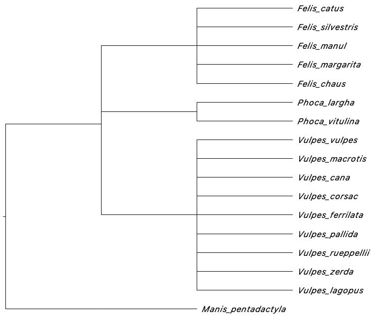

# Table of Contents
1. [Working with non-animal/plant groups in `phruta`](#paragraph0)
2. [Creating taxonomic constraints in `phruta`](#paragraph1)
3. [Running PartitionFinder in `phruta`](#paragraph2)
4. [Partitioned analyses in RAxML](#paragraph3)
5. [Identifying rogue taxa](#paragraph4)


## Working with non-animal nor plant groups in `phruta` <a name="paragraph0"></a>

As explained in the brief intro to `pruta`, the `sq.curate` function is primarily designed to curate taxonomic datasets using `gbif`. Alto `gbif` is extremely fast and efficient, it is largely designed to deal with animals and plants. If you're interested in using the `gbif` backbone for curating sequence regardless of the kingdom use the following approach:

```{r eval=FALSE}
taxonomy.retrieve(species_names=c("Felis_catus", "PREDICTED:_Vulpes",
                  "Phoca_largha", "PREDICTED:_Phoca" ,
                  "PREDICTED:_Manis" , "Felis_silvestris" , "Felis_nigripes"),
                  database='gbif', kingdom=NULL)
```

Note that the `kingdom` argument is set to `NULL`. However, as indicated in the first vignette, `gbif` is efficient for retrieving accurate taxonomy when we provide details on the `kingdom`. Given that all the species we're interested in are animals, we could just use:

```{r eval=FALSE}
taxonomy.retrieve(species_names=c("Felis_catus", "PREDICTED:_Vulpes",
                  "Phoca_largha", "PREDICTED:_Phoca" ,
                  "PREDICTED:_Manis" , "Felis_silvestris" , "Felis_nigripes"),
                  database='gbif', kingdom='animals')
```

We could also do the same for plants by using `plants` instead of `animals` in the `kingdom` argument. Now, what if we were interested in following other databases to retrieve taxonomic information for the species in our database? The latest version of `phruta` allow users to select the desired database. The databases follow the `taxize::classification` function. Options are: `ncbi`, `itis`, `eol`, `tropicos`,  `nbn`, `worms`, `natserv`, `bold`, `wiki`, and `pow`. Please select only one. Note that the `gbif` option in `taxize::classification` is replaced by the internal `gbif` in `phruta`.

Now, let's assume that we were interested in curating our database using `itis`:

```{r eval=FALSE}
taxonomy.retrieve(species_names=c("Felis_catus", "PREDICTED:_Vulpes",
                  "Phoca_largha", "PREDICTED:_Phoca" ,
                  "PREDICTED:_Manis" , "Felis_silvestris" , "Felis_nigripes"),
                  database='itis')
```

Using alternative databases is sometimes desirable. Please make sure you review which the best database is for your target group is before selecting one.


## Creating taxonomic constraints in `phruta` <a name="paragraph1"></a>

For different reasons, phylogenetic analyses sometimes require of tree constraints. `phruta` can automatically generate trees in accordance to taxonomy and a backbone topology. We divide constraint trees into two: (1) ingroup+outgroup and (2) particular clades.

### ingroup + outgroup

In this constraint type, `phruta` will create monophyletic groups for each of the taxonomic groups in the database (for selected target columns). Finally, it will generate tree with the same topology provided in the `Topology` argument. The user will provide the species names of the outgroup taxa as a vector of string that should fully match the names in the taxonomy file.


```{r eval=FALSE}
tree.constraint(
                taxonomy_folder = "1.CuratedSequences",
                targetColumns = c("kingdom", "phylum", "class", "order", 
                                  "family", "genus", "species_names"),
                Topology = "((ingroup), outgroup);",
                outgroup = "Manis_pentadactyla"
 )
```




### Particular clades

In this constraint type, `phruta` will create a constraint tree for particular clades. For instance, let's assume that we only need to create a tree constraining the monophyly within two genera and their sister relationships:

```{r eval=FALSE}
tree.constraint( taxonomy_folder = "1.CuratedSequences",
                 targetColumns = c("kingdom", "phylum", "class", 
                                   "order", "family", "genus", "species_names"),
                 Topology = "((Felis), (Phoca));"
 )
```

Note that the key aspect in here is the `Topology` argument. It is a newick tree.


## Running PartitionFinder in `phruta` <a name="paragraph2"></a>

With the current version of `phruta`, users are able to run PartitionFinder v1 within R. For this, users should provide the name of the folder where the alignments are stored, a particular pattern in the file names ( `masked` in our case), and which models will be run in PartitionFinder. This function will download PartitionFinder, generate the input files, and run it all within R. The output files will be in a new folder within the working directory.

```{r eval=FALSE}
sq.partitionfinderv1(folderAlignments = "2.Alignments",
                    FilePatterns = "Masked",
                    models = "all"
 )
```


Unfortunately, the output files are not integrated with the current `phruta` pipeline. This will be part of a new release. However, users can still perform gene-based partitioned analyses within `RAxML` or can use PartitionFinder's output files to inform their own analyses outside `phruta`.

## Partitioned analyses in RAxML <a name="paragraph3"></a>

Users can now run partitioned analyses in `RAxML` within `phruta`. This approach is implemented by setting the `partitioned` argument in `tree.raxml` to `TRUE`. For now, partitions are based on the genes are being analyzed. The same model is used to analyze each partition. More details on partitioned analyses can be customized by passing arguments in `ips::raxml`.


```{r eval=FALSE}
tree.raxml(folder = "2.Alignments", FilePatterns = "Masked",
           raxml_exec = "raxmlHPC", Bootstrap = 100,
           outgroup = "Manis_pentadactyla",
           partitioned=T
)
```


## Identifying rogue taxa <a name="paragraph4"></a>

`phruta` can help users run `RogueNaRok` implemented in the `Rogue` R package. Users can then examine whether rogue taxa should be excluded from the analyses. `tree.roguetaxa` uses the bootstrap trees generated using the `tree.raxml` function along with the associated best tree to identify rogue taxa.  


```{r eval=FALSE}
tree.roguetaxa(folder = "3.Phylogeny")
```


