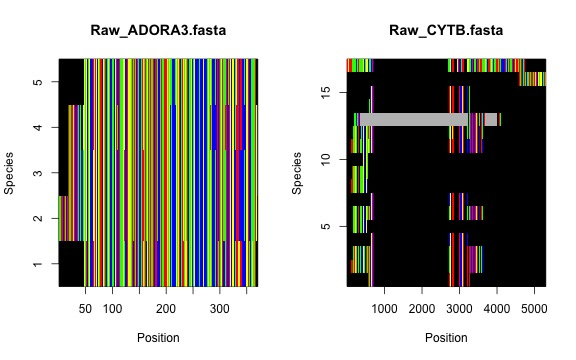

In this vignette, we will be retrieving sequences from genbank using `phruta`. We will need a list of taxa and the names of particular gene regions that need to be sampled. If you have no idea on what genes you should sample - `phruta`'ve got your back. Just check the "Introduction to the \`phruta\` R package" and "To export or not export \`phruta\` outputs" vignettes.

Now, given that we already have some target genes in mind, we can avoid using `gene.sampling.retrieve()`. We won't generate an accession table using `acc.table.retrieve()` at the beginning, mostly because the sampling that we're using in `phruta` this time. Therefore, `sq.retrieve.direct()` is less flexible than `sq.retrieve.indirect()`. As noted before, `sq.retrieve.direct()` does its best to directly (i.e. without input from the user) retrieve sequences for a target set of taxa and set of gene regions. You are more likely to catch errors using `sq.retrieve.indirect()`. However, mistakes will be harder to spot and fix when using `sq.retrieve.direct()`.

Let's first start by loading `phruta`!


```r
library(phruta)
```


Let's download gene sequences for the taxa in *Felis*, *Vulpes*, and *Phoca*. Tjhis species-level sampling corresponds with the one in other vignettes. We will be sampling only two gene regions using `sq.retrieve.direct()`. Note that we're going to be using the list of species for the target genera from the gbif taxonomic backbone (hence `db = "gbif"`). There are more databases available for this (please check `taxize::downstream()`).


```r
sq.retrieve.direct(
  clades = c("Felis", "Vulpes", "Phoca"),
  species = "Manis_pentadactyla",
  genes = c("ADORA3", "CYTB"),
  db = "gbif"
)
```

The code above will create a folder `0.Sequences` in your working directory. Note that `sq.retrieve.direct()` does not return objects to the environment. The rest of this tutorial follow the same structure as the "To export or not export \`phruta\` outputs" vignette.

For instance, we can use the `sq.curate()` function to remove highly divergent sequences. This function will also remove observations from species that are not within our target taxonomic groups.


```r
sq.curate(filterTaxonomicCriteria = 'Felis|Vulpes|Phoca|Manis',
                         kingdom = 'animals', 
                         folder = "0.Sequences",
                         removeOutliers = FALSE,
                         minSeqs = 2)
```

Let's review the current sampling...


Table: 4. Preliminary accession number table

|OriginalNames                                                                                                                                                                                                                                |AccN     |Species            |file         |OldSpecies         |
|:--------------------------------------------------------------------------------------------------------------------------------------------------------------------------------------------------------------------------------------------|:--------|:------------------|:------------|:------------------|
|AY011246.1 Felis catus adenosine A3 receptor (ADORA3) gene, partial cds                                                                                                                                                                      |AY011246 |Felis_catus        |ADORA3.fasta |Felis_catus        |
|GU167614.1 Vulpes lagopus adenosine A3 receptor (ADORA3) gene, exon 2 and partial cds                                                                                                                                                        |GU167614 |Vulpes_lagopus     |ADORA3.fasta |Vulpes_lagopus     |
|GU167677.1 Phoca largha adenosine A3 receptor (ADORA3) gene, exon 2 and partial cds                                                                                                                                                          |GU167677 |Phoca_largha       |ADORA3.fasta |Phoca_largha       |
|GU930874.1 Phoca vitulina adenosine A3 receptor (ADORA3) gene, partial cds                                                                                                                                                                   |GU930874 |Phoca_vitulina     |ADORA3.fasta |Phoca_vitulina     |
|AY011251.1 Manis pentadactyla adenosine A3 receptor (ADORA3) gene, partial cds                                                                                                                                                               |AY011251 |Manis_pentadactyla |ADORA3.fasta |Manis_pentadactyla |
|MH558234.1 Felis silvestris bieti isolate FBIPHap2 NADH dehydrogenase subunit 5 (ND5) and NADH dehydrogenase subunit 6 (ND6) genes, complete cds; tRNA-Glu gene, complete sequence; and cytochrome b (CytB) gene, partial cds; mitochondrial |MH558234 |Felis_silvestris   |CYTB.fasta   |Felis_silvestris   |
|MW267829.1 Felis catus isolate VA79_2017 cytochrome b (cytb) gene, partial cds; mitochondrial                                                                                                                                                |MW267829 |Felis_catus        |CYTB.fasta   |Felis_catus        |
|MN370575.1 Felis chaus isolate Jungle Cat 5 cytochrome b (cytb) gene, partial cds; mitochondrial                                                                                                                                             |MN370575 |Felis_chaus        |CYTB.fasta   |Felis_chaus        |
|OM970983.1 Otocolobus manul isolate 6-1-11B cytochrome b (cytb) gene, partial cds; mitochondrial                                                                                                                                             |OM970983 |Felis_manul        |CYTB.fasta   |Otocolobus_manul   |
|MK606132.1 Felis margarita haplotype AH NADH dehydrogenase subunit 5 (ND5) and cytochrome b (cytb) genes, partial cds; and tRNA-Thr gene and D-loop, partial sequence; mitochondrial                                                         |MK606132 |Felis_margarita    |CYTB.fasta   |Felis_margarita    |
|KU378587.1 Vulpes cana isolate B.F.Y3 cytochrome b (cytb) gene, partial cds; mitochondrial                                                                                                                                                   |KU378587 |Vulpes_cana        |CYTB.fasta   |Vulpes_cana        |
|MT795179.1 Vulpes corsac isolate SH21 cytochrome b (CYTB) gene, complete cds; mitochondrial                                                                                                                                                  |MT795179 |Vulpes_corsac      |CYTB.fasta   |Vulpes_corsac      |
|EU872065.1 Vulpes ferrilata haplotype 1 cytochrome b (cytb) gene, partial cds; mitochondrial                                                                                                                                                 |EU872065 |Vulpes_ferrilata   |CYTB.fasta   |Vulpes_ferrilata   |
|KX093945.1 Vulpes lagopus haplotype 5 cytochrome b (cytb) gene, partial cds; mitochondrial                                                                                                                                                   |KX093945 |Vulpes_lagopus     |CYTB.fasta   |Vulpes_lagopus     |
|AF028157.1 Vulpes macrotis cytochrome b (cytb) gene, mitochondrial gene encoding mitochondrial protein, partial cds                                                                                                                          |AF028157 |Vulpes_macrotis    |CYTB.fasta   |Vulpes_macrotis    |
|KJ597964.1 Vulpes pallida haplotype PMa2 cytochrome b (cytb) gene, partial cds; mitochondrial                                                                                                                                                |KJ597964 |Vulpes_pallida     |CYTB.fasta   |Vulpes_pallida     |
|KU378373.1 Vulpes rueppellii isolate R.F.Y6 cytochrome b (cytb) gene, partial cds; mitochondrial                                                                                                                                             |KU378373 |Vulpes_rueppellii  |CYTB.fasta   |Vulpes_rueppellii  |
|MK244494.1 Vulpes vulpes isolate LD124 haplotype FOX cytochrome b (CYTB) gene, partial cds; mitochondrial                                                                                                                                    |MK244494 |Vulpes_vulpes      |CYTB.fasta   |Vulpes_vulpes      |
|MH854561.1 Vulpes zerda isolate X161349 cytochrome b (Cytb) gene, partial cds; mitochondrial                                                                                                                                                 |MH854561 |Vulpes_zerda       |CYTB.fasta   |Vulpes_zerda       |
|LC466150.1 Phoca largha PLCBNo6 mitochondrial cytb gene for cytochrome b, partial cds                                                                                                                                                        |LC466150 |Phoca_largha       |CYTB.fasta   |Phoca_largha       |
|AB510422.1 Phoca vitulina stejnegeri mitochondrial cytb gene for cytochrome b, complete cds, isolate: Pvs15                                                                                                                                  |AB510422 |Phoca_vitulina     |CYTB.fasta   |Phoca_vitulina     |
|OP748355.1 Manis pentadactyla voucher MBSV033 cytochrome b (cytb) gene, partial cds; mitochondrial                                                                                                                                           |OP748355 |Manis_pentadactyla |CYTB.fasta   |Manis_pentadactyla |

Now, we'll align the sequences that we just curated. For this, we use `sq.aln()` with under default parameters.


```r
sq.aln(folder = '1.CuratedSequences', FilePatterns = "renamed")
```

The resulting multiple sequence alignments will be saved to `sqs.aln()` object, a list. For each of the gene regions, we will have access to the original alignment (`Aln.Original`), the masked one (`Aln.Masked`), and information on the masking process. Let's first check the raw alignments...


 
Now, the masked alignments...


 


And we're done for now!! You can compare the sampling between the main three tutorials using `sq.retrieve.direct()` and `sq.retrieve.indirect()`. In total, this vignette took 4 minutes to render in my local machine.


