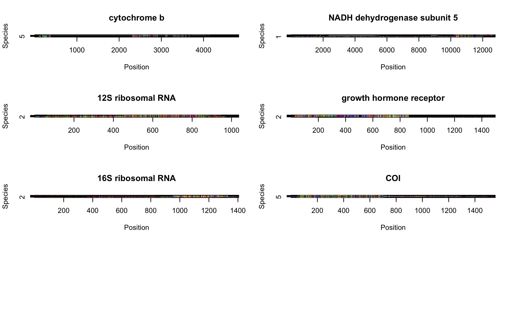
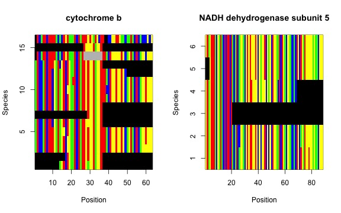

```{r include = FALSE}
knitr::opts_chunk$set(eval = TRUE, warning = FALSE, message = FALSE, progress = FALSE)
unlink(c("0.Sequences", "1.CuratedSequences", "2.Alignments"), recursive = TRUE)
start_time <- Sys.time()
library(knitr)
```

# Table of Contents

1.  [Desde nombres taxonomicos a alineamientos](#paragraph1)
2.  [Guardando objetos intermedios](#paragraph2)

## Desde nombres taxonomicos a alineamientos <a name="paragraph1"></a>

Let's learn how `phruta` works by assembling a molecular dataset at the species level for a few mammal clades. For this tutorial, assume that we need to build a tree for the following three genera: *Felis, Vulpes*, and *Phoca*. All three genera are classified within the order Carnivora. Both *Felis* and *Vulpes* are classified in different superfamilies within the suborder Fissipedia. *Phoca* is part of another suborder, Pinnipedia. We're going to root our tree with another mammal species, the Chinese Pangolin (*Manis pentadactyla*). Please note that you can select as many target clades and species as you need. However, for simplicity, we will run the analyses using three genera in the ingroup and a single outgroup species.

We have decided the taxonomic make of our analyses. However, we also need to determine the genes that we could use to infer our phylogeny. Fortunately, mammals are extensively studied. For instance, a comprehensive list of potential gene regions to be analyzed for species in this clade is already available in [Upham et al (2009)](https://journals.plos.org/plosbiology/article?id=10.1371/journal.pbio.3000494#sec030). For this tutorial, we will try to find the gene regions are well sampled specifically for the target taxa. I believe that figuring out the best sampled gene regions in genbank, instead of providing names, is potentially more valuable when working with poorly studied groups. For this tutorial, all the objects that are created using functions in `phruta` will be stored in your environment. None of these files will be exported to your working directory. If instead you were interested in exporting the outcomes of particular functions in `phruta`, please follow the tutorial in "To export or not export \`phruta\` outputs". Both vignettes aim to assemble a molecular dataset for the same set of taxa under the same approach in `phruta`.

Let's get started with this tutorial by loading `phruta`!

```{r eval = TRUE, warning = TRUE, message = TRUE, progress = TRUE}
library(phruta)
```

```{r setup, echo=FALSE, include = FALSE}
assign(".testMode", TRUE, envir = phruta:::pkg.env)
```

Let's now look for the gene regions that are extensively sampled in our target taxa. For this, we will use the `gene.sampling.retrieve()` function in `phruta`. The resulting `data.frame`, named `gs.seqs` in this example, will contain the list of full names for genes sampled in genbank for the target taxa.

```{r results = 'hide'}
gs.seqs <- gene.sampling.retrieve(organism = c("Felis", "Vulpes", "Phoca", "Manis_pentadactyla"), 
                                  speciesSampling = TRUE)
```

For the search terms, `phruta` was able to retrieve the names for `r nrow(gs.seqs)` gene regions. The frequency estimates per gene are based on inter-specific sampling.

```{r echo=FALSE}
kable(head(gs.seqs), caption = "Gene sampling for the search including the genera Felis, Vulpes, Phoca as the ingroup taxa. Manis pentadactyla was used as outgroup.")
```

The `gene.sampling.retrieve` provides an estimate of the number of species in genbank (matching the taxonomic criteria of the search term) that have sequences for a given gene region. However, this estimate is only as good as the annotations for genes deposited in genbank.

From here, we will generate a preliminary summary of the accession numbers sampled for the combination of target taxa and gene regions. In fact, not all these accession numbers are expected to be in the final (curated) molecular dataset. Using the `acc.table.retrieve` function, we will assemble a species-level summary of accession numbers (hence the `speciesLevel = TRUE` argument). For simplicity, this tutorial will focus on sampling gene regions that are sampled in \>30% of the species (`targetGenes` data.frame).

```{r  results = 'hide'}
targetGenes <- gs.seqs[gs.seqs$PercentOfSampledSpecies > 30,]

acc.table <- acc.table.retrieve(
            clades  = c('Felis', 'Vulpes', 'Phoca'),
            species = 'Manis_pentadactyla',
            genes = targetGenes$Gene,
            speciesLevel = TRUE
          )
```

The `acc.table` object is a `data.frame` that is later on going to be used for downloading locally the relevant gene sequences. In this case, the dataset includes the following information:

```{r echo=FALSE}
row.names(acc.table) <- NULL
kable(acc.table, caption = 'Accession numbers for the relevant species and gene regions examined in this tutorial.')
```

Feel free to review this dataset, make changes, add new species, samples, etc. The integrity of this dataset is critical for the next steps so please take your time and review it carefully. Let's just make some minor changes to our dataset:

```{r}
acc.table$Species <- sub("P.", "Phoca ", acc.table$Species, fixed = TRUE)
acc.table$Species <- sub("F.", "Felis ", acc.table$Species, fixed = TRUE)
acc.table$Species <- sub("V.", "Vulpes ", acc.table$Species, fixed = TRUE)
acc.table$Species <- sub("mitochondrial", "", acc.table$Species)
row.names(acc.table) <- NULL
```

Let's check how the new table looks now...

```{r echo = FALSE}
kable(acc.table, caption = 'Updated Table 2 with some minor corrections on species names. Other updates to this table include adding more sequences, using specific sequences (instead of the ones suggested by `phruta`).')
```

Now, since we're going to retrieve sequences from genbank using an existing preliminary accession numbers table, we will use the `sq.retrieve.indirect` function in `phruta`. Please note that there are two versions of `sq.retrieve.*` in `phruta` . The one that we're using in this tutorial, `sq.retrieve.indirect`, retrieves sequences "indirectly" because it necessarily follows the initial step of generating a table summarizing target accession numbers (see the `acc.table.retrieve` function above). I present the information in this vignette using `sq.retrieve.indirect` instead of `sq.retrieve.direct` because the first function is way more flexible. Specifically, it allows for correcting issues *prior* to downloading/retrieving any sequence. For instance, you can add new sequences, species, populations to the resulting data.frame from `acc.table.retrieve`. Additionally, you could even manually assemble your own dataset of accession numbers to be retrieved using `sq.retrieve.indirect`. Instead, `sq.retrieve.direct` does its best to directly (i.e. without input from the user) retrieve sequences for a target set of taxa and set of gene regions. In short, you should be able to catch errors using `sq.retrieve.indirect` but mistakes will be harder to spot and fix if you're using `sq.retrieve.direct`.

Now, we still need to retrieve all the sequences from the accessions table generated using `acc.table`. Note that since we have specified `download.sqs = FALSE`, the sequences are returned in a list that is stored in your global environment. If we decide to download the sequences to our working directory using `download.sqs = TRUE`, `phruta` will write all the resulting `fasta` files into a newly created folder `0.Sequences` located in our working directory. The latter option is covered in the "To export or not export \`phruta\` outputs" vignette.

```{r results = 'hide'}
sqs.downloaded <- sq.retrieve.indirect(acc.table = acc.table, download.sqs = FALSE)
```

We're now going to make sure that we include only sequences that are reliable and from species that we are actually interested in analyzing. We're going to use the `sq.curate` function for this. We will provide a list of taxonomic criteria to filter out incorrect sequences (`filterTaxonomicCriteria` argument). For instance, we could simply provide a vector of the genera that we're interested in analyzing. Note that the outgroup's name should also be included among the target taxa. If the taxonomic information for a sequence retrieved from genbank does not match with any of these strings, this species will be dropped. You will have to specify whether sampling is for animals or plants (`kingdom` argument). Finally, you might have already noticed that, sometimes, gene regions have alternative names. In our case, we are going to merge "cytochrome oxidase subunit 1" and "cytochrome c oxidase subunit I" into a single file named `COI`. To merge gene files during the curation step, you will have to provide a named list to the `mergeGeneFiles` argument of the `sq.curate` function. This named list (`tb.merged` in our tutorial) will have a length that equals the number of final files that will result from merging the target gene files. Note that, since we're not downloading anything to our working directory, we need to pass our downloaded sequences (`sqs.downloaded` object generated above using the `sq.retrieve.indirect` function) to the `sqs.object` argument in `sq.curate`.

```{r results = 'hide'}
tb.merged <- list('COI' = c("cytochrome oxidase subunit 1", "cytochrome c oxidase subunit I"))
sqs.curated <- sq.curate(filterTaxonomicCriteria = 'Felis|Vulpes|Phoca|Manis',
                         mergeGeneFiles = tb.merged,
                         kingdom = 'animals', 
                         sqs.object = sqs.downloaded,
                         removeOutliers = FALSE)
```

Running the `sq.curate` function will create an object of class list that includes (1) the curated sequences with original names, (2) the curated sequences with species-level names (`renamed_*` prefix), (3) the accession numbers table (`AccessionTable`), and (4) a summary of taxonomic information for all the species sampled in the files (`Taxonomy.csv`).

```{r echo = FALSE}
accTable <- sqs.curated$AccessionTable
kable(accTable, caption = "4. Preliminary accession number table")
```

Now, we'll align the sequences that we just curated. For this, we just use `sq.aln` with default parameters. We're again passing the output from `sq.curate`, `sqs.curated`, using the `sqs.object` argument in `sq.aln`.

```{r  results = 'hide'}
sqs.aln <- sq.aln(sqs.object = sqs.curated)
```

The resulting multiple sequence alignments will be saved to `sqs.aln` object, a list. For each of the gene regions, we will have access to the original alignment (`Aln.Original`), the masked one (`Aln.Masked`), and information on the masking process.

Note that we could use these resulting alignments to infer phylogenies. We cover these steps within `phruta` in another vignette: "Phylogenetics with the `phruta` R package". For now, let's wrap up and plot one of our cool alignments. Let's first check the raw alignments.

```{r echo = FALSE}
library(ape)
jpeg("UFE.Raw.jpeg", width = 8, height = 5, units = "in", res = 72)
par(mfrow = c(ceiling(length(sqs.aln)/2),2))
for (i in seq_along(sqs.aln)) {
  if(!is.null(sqs.aln[[i]]$Aln.Original)){
  image(sqs.aln[[i]]$Aln.Original, main = names(sqs.aln)[i], show.labels = FALSE, xlab = "Position",
        ylab = "Species", legend = FALSE)
  }
}
sv <- dev.off()
```

 

Now, the masked alignments...

```{r echo = FALSE}
jpeg("UFE.Cur.jpeg", width = 8, height = 5, units = "in", res = 72)
par(mfrow = c(ceiling(length(sqs.aln)/2),2))
for (i in seq_along(sqs.aln)) {
  if(!is.null(sqs.aln[[i]]$Aln.Masked)){
  image(sqs.aln[[i]]$Aln.Masked, main = names(sqs.aln)[i], show.labels = FALSE, xlab = "Position",
        ylab = "Species", legend = FALSE)
  }
}
sv <- dev.off()
```

 

```{r echo = FALSE}
end_time <- Sys.time()
```


```{r include = FALSE}
#Deleting the extra elements...
#unlink(c("UFE.Cur.jpeg", "UFE.Raw.jpeg"), recursive = TRUE)
```


Note that you could share the resulting workspace with your coworkers or add it to the supplement to your article!! In total, this script took `r round(end_time-start_time)` minutes to run in my local machine. You can now try to run `phruta` in your favorite group organisms! Don't forget to check the other tutorials...Buena suerte!

## Guardando objetos intermedios <a name="paragraph2"></a>

Note that this current vignette is structured such that the functions used in this tutorial won't not write anything to your working directory. An advantage of this approach is that you could simply save the workspace and make your pipeline fully reproducible to others. However, sometimes the molecular dataset is simply to large to be analyzed in `R`. For those cases, `phruta` is able to export the relevant files into folder that are created within the working directory. If you're interested in saving partial outputs, please follow the `Exporting sequences using the phruta R package` vignette associated to this package.
