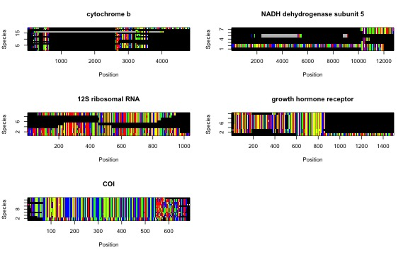
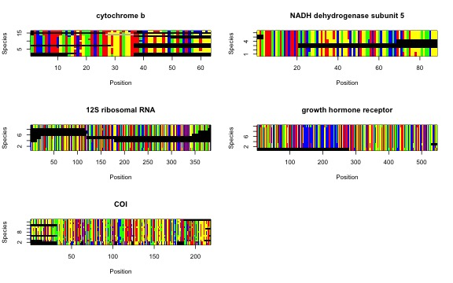

# Table of Contents

1.  [Desde nombres taxonomicos a alineamientos](#paragraph1)
2.  [Guardando objetos intermedios](#paragraph2)

## Desde nombres taxonomicos a alineamientos <a name="paragraph1"></a>

Let's learn how `phruta` works by assembling a molecular dataset at the species level for a few mammal clades. For this tutorial, assume that we need to build a tree for the following three genera: *Felis, Vulpes*, and *Phoca*. All three genera are classified within the order Carnivora. Both *Felis* and *Vulpes* are classified in different superfamilies within the suborder Fissipedia. *Phoca* is part of another suborder, Pinnipedia. We're going to root our tree with another mammal species, the Chinese Pangolin (*Manis pentadactyla*). Please note that you can select as many target clades and species as you need. However, for simplicity, we will run the analyses using three genera in the ingroup and a single outgroup species.

We have decided the taxonomic make of our analyses. However, we also need to determine the genes that we could use to infer our phylogeny. Fortunately, mammals are extensively studied. For instance, a comprehensive list of potential gene regions to be analyzed for species in this clade is already available in [Upham et al (2009)](https://journals.plos.org/plosbiology/article?id=10.1371/journal.pbio.3000494#sec030). For this tutorial, we will try to find the gene regions are well sampled specifically for the target taxa. I believe that figuring out the best sampled gene regions in genbank, instead of providing names, is potentially more valuable when working with poorly studied groups. For this tutorial, all the objects that are created using functions in `phruta` will be stored in your environment. None of these files will be exported to your working directory. If instead you were interested in exporting the outcomes of particular functions in `phruta`, please follow the tutorial in "To export or not export \`phruta\` outputs". Both vignettes aim to assemble a molecular dataset for the same set of taxa under the same approach in `phruta`.

Let's get started with this tutorial by loading `phruta`!


```r
library(phruta)
```


Let's now look for the gene regions that are extensively sampled in our target taxa. For this, we will use the `gene.sampling.retrieve()` function in `phruta`. The resulting `data.frame`, named `gs.seqs` in this example, will contain the list of full names for genes sampled in genbank for the target taxa.


```r
gs.seqs <- gene.sampling.retrieve(organism = c("Felis", "Vulpes", "Phoca", "Manis_pentadactyla"), 
                                  speciesSampling = TRUE)
```

For the search terms, `phruta` was able to retrieve the names for 1366 gene regions. The frequency estimates per gene are based on inter-specific sampling.


Table: Gene sampling for the search including the genera Felis, Vulpes, Phoca as the ingroup taxa. Manis pentadactyla was used as outgroup.

|Gene                           | Sampled in N species| PercentOfSampledSpecies|
|:------------------------------|--------------------:|-----------------------:|
|cytochrome b                   |                   26|                76.47059|
|NADH dehydrogenase subunit 5   |                   14|                41.17647|
|cytochrome oxidase subunit 1   |                   12|                35.29412|
|12S ribosomal RNA              |                   11|                32.35294|
|cytochrome c oxidase subunit I |                   11|                32.35294|
|growth hormone receptor        |                   11|                32.35294|

The `gene.sampling.retrieve` provides an estimate of the number of species in genbank (matching the taxonomic criteria of the search term) that have sequences for a given gene region. However, this estimate is only as good as the annotations for genes deposited in genbank.

From here, we will generate a preliminary summary of the accession numbers sampled for the combination of target taxa and gene regions. In fact, not all these accession numbers are expected to be in the final (curated) molecular dataset. Using the `acc.table.retrieve` function, we will assemble a species-level summary of accession numbers (hence the `speciesLevel = TRUE` argument). For simplicity, this tutorial will focus on sampling gene regions that are sampled in \>30% of the species (`targetGenes` data.frame).


```r
targetGenes <- gs.seqs[gs.seqs$PercentOfSampledSpecies > 30,]

acc.table <- acc.table.retrieve(
            clades  = c('Felis', 'Vulpes', 'Phoca'),
            species = 'Manis_pentadactyla',
            genes = targetGenes$Gene,
            speciesLevel = TRUE
          )
```

The `acc.table` object is a `data.frame` that is later on going to be used for downloading locally the relevant gene sequences. In this case, the dataset includes the following information:


Table: Accession numbers for the relevant species and gene regions examined in this tutorial.

|Species                      |Ti                                                                                                                                                                                                                                                                                                                                                                                                                                                                                              |Acc      |gene                           |
|:----------------------------|:-----------------------------------------------------------------------------------------------------------------------------------------------------------------------------------------------------------------------------------------------------------------------------------------------------------------------------------------------------------------------------------------------------------------------------------------------------------------------------------------------|:--------|:------------------------------|
|Felis silvestris             |Felis silvestris silvestris isolate FS_101 NADH dehydrogenase subunit 5 (ND5) gene, partial cds; NADH dehydrogenase subunit 6 (ND6) gene, complete cds; tRNA-Glu gene, complete sequence; and cytochrome b (cytb) gene, partial cds; mitochondrial                                                                                                                                                                                                                                              |OL654361 |cytochrome b                   |
|Felis catus                  |Felis catus MKRaS008 mitochondrial gene for cytochrome b, partial cds                                                                                                                                                                                                                                                                                                                                                                                                                           |LC649705 |cytochrome b                   |
|Felis chaus                  |Felis chaus isolate Jungle Cat 5 cytochrome b (cytb) gene, partial cds; mitochondrial                                                                                                                                                                                                                                                                                                                                                                                                           |MN370575 |cytochrome b                   |
|Felis environmental          |Felis environmental sample isolate Kw-170 cytochrome b (cytb) gene, partial cds; mitochondrial                                                                                                                                                                                                                                                                                                                                                                                                  |MK510873 |cytochrome b                   |
|Felis margarita              |Felis margarita haplotype AH NADH dehydrogenase subunit 5 (ND5) and cytochrome b (cytb) genes, partial cds; and tRNA-Thr gene and D-loop, partial sequence; mitochondrial                                                                                                                                                                                                                                                                                                                       |MK606132 |cytochrome b                   |
|Felis bieti                  |Felis bieti cytochrome b gene, partial cds; mitochondrial                                                                                                                                                                                                                                                                                                                                                                                                                                       |AY773081 |cytochrome b                   |
|F.domesticus mitochondrial   |F.domesticus mitochondrial cytochrome b gene                                                                                                                                                                                                                                                                                                                                                                                                                                                    |X82296   |cytochrome b                   |
|Vulpes vulpes                |Vulpes vulpes isolate LH198 haplotype FOX14 cytochrome b (CYTB) gene, partial cds; mitochondrial                                                                                                                                                                                                                                                                                                                                                                                                |MK244493 |cytochrome b                   |
|Vulpes corsac                |Vulpes corsac isolate SH21 cytochrome b (CYTB) gene, complete cds; mitochondrial                                                                                                                                                                                                                                                                                                                                                                                                                |MT795179 |cytochrome b                   |
|Vulpes zerda                 |Vulpes zerda isolate X161349 cytochrome b (Cytb) gene, partial cds; mitochondrial                                                                                                                                                                                                                                                                                                                                                                                                               |MH854561 |cytochrome b                   |
|Vulpes cana                  |Vulpes cana isolate B.F.Y3 cytochrome b (cytb) gene, partial cds; mitochondrial                                                                                                                                                                                                                                                                                                                                                                                                                 |KU378587 |cytochrome b                   |
|Vulpes rueppellii            |Vulpes rueppellii isolate R.F.Y6 cytochrome b (cytb) gene, partial cds; mitochondrial                                                                                                                                                                                                                                                                                                                                                                                                           |KU378373 |cytochrome b                   |
|Vulpes lagopus               |Vulpes lagopus haplotype 5 cytochrome b (cytb) gene, partial cds; mitochondrial                                                                                                                                                                                                                                                                                                                                                                                                                 |KX093945 |cytochrome b                   |
|Vulpes ferrilata             |Vulpes ferrilata haplotype 1 cytochrome b (cytb) gene, partial cds; mitochondrial                                                                                                                                                                                                                                                                                                                                                                                                               |EU872065 |cytochrome b                   |
|Vulpes macrotis              |Vulpes macrotis cytochrome b (cytb) gene, mitochondrial gene encoding mitochondrial protein, partial cds                                                                                                                                                                                                                                                                                                                                                                                        |AF028157 |cytochrome b                   |
|Vulpes pallida               |Vulpes pallida haplotype PMa2 cytochrome b (cytb) gene, partial cds; mitochondrial                                                                                                                                                                                                                                                                                                                                                                                                              |KJ597964 |cytochrome b                   |
|Phoca largha                 |Phoca largha PLCBRe4 mitochondrial cytb gene for cytochrome b, partial cds                                                                                                                                                                                                                                                                                                                                                                                                                      |LC466149 |cytochrome b                   |
|Pagophilus groenlandicus     |Pagophilus groenlandicus cytochrome b gene, partial cds; mitochondrial gene for mitochondrial product                                                                                                                                                                                                                                                                                                                                                                                           |AF200491 |cytochrome b                   |
|Phoca groenlandica           |Phoca groenlandica cytochrome b (cytb) gene, complete cds; mitochondrial                                                                                                                                                                                                                                                                                                                                                                                                                        |GU174609 |cytochrome b                   |
|Phoca fasciata               |Phoca fasciata cytochrome b (cytb) gene, complete cds; mitochondrial                                                                                                                                                                                                                                                                                                                                                                                                                            |GU167294 |cytochrome b                   |
|Phoca vitulina               |Phoca vitulina mitochondrial cytochrome b gene, partial cds                                                                                                                                                                                                                                                                                                                                                                                                                                     |L19127   |cytochrome b                   |
|P.vitulina mitochondrial     |P.vitulina mitochondrial cytochrome b gene                                                                                                                                                                                                                                                                                                                                                                                                                                                      |X82306   |cytochrome b                   |
|P.largha mitochondrial       |P.largha mitochondrial cytochrome b gene                                                                                                                                                                                                                                                                                                                                                                                                                                                        |X82305   |cytochrome b                   |
|P.groenlandica mitochondrial |P.groenlandica mitochondrial cytochrome b gene                                                                                                                                                                                                                                                                                                                                                                                                                                                  |X82303   |cytochrome b                   |
|P.fasciata mitochondrial     |P.fasciata mitochondrial cytochrome b gene                                                                                                                                                                                                                                                                                                                                                                                                                                                      |X82302   |cytochrome b                   |
|Manis pentadactyla           |Manis pentadactyla isolate ST08 cytochrome b (cytb) gene, partial cds; mitochondrial                                                                                                                                                                                                                                                                                                                                                                                                            |MW197469 |cytochrome b                   |
|Felis silvestris             |Felis silvestris silvestris isolate FS_101 NADH dehydrogenase subunit 5 (ND5) gene, partial cds; NADH dehydrogenase subunit 6 (ND6) gene, complete cds; tRNA-Glu gene, complete sequence; and cytochrome b (cytb) gene, partial cds; mitochondrial                                                                                                                                                                                                                                              |OL654361 |NADH dehydrogenase subunit 5   |
|Felis catus                  |Felis catus isolate 4709-K NADH dehydrogenase subunit 5 (ND5) gene, partial cds; NADH dehydrogenase subunit 6 (ND6) gene, complete cds; tRNA-Glu gene, complete sequence; and cytochrome b (CYTB) gene, partial cds; mitochondrial                                                                                                                                                                                                                                                              |MN313781 |NADH dehydrogenase subunit 5   |
|Felis margarita              |Felis margarita haplotype AH NADH dehydrogenase subunit 5 (ND5) and cytochrome b (cytb) genes, partial cds; and tRNA-Thr gene and D-loop, partial sequence; mitochondrial                                                                                                                                                                                                                                                                                                                       |MK606132 |NADH dehydrogenase subunit 5   |
|Felis chaus                  |Felis chaus isolate JCAIZ003 NADH dehydrogenase subunit 5 (ND5) gene, partial cds; mitochondrial                                                                                                                                                                                                                                                                                                                                                                                                |GU561700 |NADH dehydrogenase subunit 5   |
|Felis nigripes               |Felis nigripes NADH dehydrogenase subunit 5 gene, partial cds; mitochondrial                                                                                                                                                                                                                                                                                                                                                                                                                    |AF006400 |NADH dehydrogenase subunit 5   |
|Felis libyca                 |Felis libyca NADH dehydrogenase subunit 5 gene, partial cds; mitochondrial                                                                                                                                                                                                                                                                                                                                                                                                                      |AF006396 |NADH dehydrogenase subunit 5   |
|Vulpes lagopus               |Vulpes lagopus ATP synthase F0 subunit 6 (ATP6), ATP synthase F0 subunit 8 (ATP8), cytochrome c oxidase subunit I (COX1), cytochrome c oxidase subunit II (COX2), cytochrome c oxidase subunit III (COX3), cytochrome b (CYTB), NADH dehydrogenase subunit 1 (ND1), NADH dehydrogenase subunit 2 (ND2), NADH dehydrogenase subunit 3 (ND3), NADH dehydrogenase subunit 4 (ND4), NADH dehydrogenase subunit 4L (ND4L), and NADH dehydrogenase subunit 5 (ND5) genes, complete cds; mitochondrial |AH014073 |NADH dehydrogenase subunit 5   |
|Phoca groenlandica           |Phoca groenlandica NADH dehydrogenase subunit 5 (ND5) gene, complete cds; mitochondrial gene for mitochondrial product                                                                                                                                                                                                                                                                                                                                                                          |AY377376 |NADH dehydrogenase subunit 5   |
|Phoca fasciata               |Phoca fasciata NADH dehydrogenase subunit 5 (ND5) gene, complete cds; mitochondrial                                                                                                                                                                                                                                                                                                                                                                                                             |GU167331 |NADH dehydrogenase subunit 5   |
|Felis catus                  |Felis catus voucher Cat_KU cytochrome oxidase subunit 1 (COI) gene, partial cds; mitochondrial                                                                                                                                                                                                                                                                                                                                                                                                  |MN124254 |cytochrome oxidase subunit 1   |
|Felis nigripes               |Felis nigripes voucher NZG:BWP38761 cytochrome oxidase subunit 1 (COI) gene, partial cds; mitochondrial                                                                                                                                                                                                                                                                                                                                                                                         |KX012677 |cytochrome oxidase subunit 1   |
|Felis margarita              |Felis margarita voucher 198_Fe_mar cytochrome oxidase subunit 1 (COI) gene, partial cds; mitochondrial                                                                                                                                                                                                                                                                                                                                                                                          |KF297765 |cytochrome oxidase subunit 1   |
|Vulpes vulpes                |Vulpes vulpes voucher BIOUG<CAN>:HBL008452 cytochrome oxidase subunit 1 (COI) gene, partial cds; mitochondrial                                                                                                                                                                                                                                                                                                                                                                                  |JF443560 |cytochrome oxidase subunit 1   |
|Vulpes chama                 |Vulpes chama voucher NZG:BWP38701 cytochrome oxidase subunit 1 (COI) gene, partial cds; mitochondrial                                                                                                                                                                                                                                                                                                                                                                                           |KX012672 |cytochrome oxidase subunit 1   |
|Vulpes lagopus               |Vulpes lagopus voucher HBL008485 cytochrome oxidase subunit 1 (COI) gene, partial cds; mitochondrial                                                                                                                                                                                                                                                                                                                                                                                            |JF443554 |cytochrome oxidase subunit 1   |
|Vulpes velox                 |Vulpes velox voucher ROM 105399 cytochrome oxidase subunit 1 (COI) gene, partial cds; mitochondrial                                                                                                                                                                                                                                                                                                                                                                                             |JF443557 |cytochrome oxidase subunit 1   |
|Phoca vitulina               |Phoca vitulina voucher HBL008389 cytochrome oxidase subunit 1 (COI) gene, partial cds; mitochondrial                                                                                                                                                                                                                                                                                                                                                                                            |JF443364 |cytochrome oxidase subunit 1   |
|Phoca largha                 |Phoca largha voucher HBL008423 cytochrome oxidase subunit 1 (COI) gene, partial cds; mitochondrial                                                                                                                                                                                                                                                                                                                                                                                              |JF443363 |cytochrome oxidase subunit 1   |
|Phoca groenlandica           |Phoca groenlandica voucher HBL008364 cytochrome oxidase subunit 1 (COI) gene, partial cds; mitochondrial                                                                                                                                                                                                                                                                                                                                                                                        |JF443362 |cytochrome oxidase subunit 1   |
|Manis pentadactyla           |Manis pentadactyla isolate KFBG_HZ0050 cytochrome oxidase subunit 1 gene, partial cds; mitochondrial                                                                                                                                                                                                                                                                                                                                                                                            |KT428152 |cytochrome oxidase subunit 1   |
|Felis catus                  |Felis catus voucher N22b 12S ribosomal RNA gene, partial sequence; mitochondrial                                                                                                                                                                                                                                                                                                                                                                                                                |KX786344 |12S ribosomal RNA              |
|Felis chaus                  |Felis chaus isolate G 12S ribosomal RNA gene, partial sequence; mitochondrial                                                                                                                                                                                                                                                                                                                                                                                                                   |KU963205 |12S ribosomal RNA              |
|Felis silvestris             |Felis silvestris 12S ribosomal RNA gene, partial sequence; mitochondrial                                                                                                                                                                                                                                                                                                                                                                                                                        |KX002032 |12S ribosomal RNA              |
|Felis bieti                  |Felis bieti 12S ribosomal RNA gene, partial sequence; mitochondrial                                                                                                                                                                                                                                                                                                                                                                                                                             |AY773084 |12S ribosomal RNA              |
|Vulpes vulpes                |Vulpes vulpes Vv1 mitochondrial gene for 12S ribosomal RNA, partial sequence                                                                                                                                                                                                                                                                                                                                                                                                                    |LC424764 |12S ribosomal RNA              |
|Vulpes lagopus               |Vulpes lagopus isolate FRT12 12S ribosomal RNA gene, partial sequence; mitochondrial                                                                                                                                                                                                                                                                                                                                                                                                            |KM224240 |12S ribosomal RNA              |
|Phoca fasciata               |Phoca fasciata isolate 5888 12S ribosomal RNA gene, partial sequence; mitochondrial                                                                                                                                                                                                                                                                                                                                                                                                             |GU174595 |12S ribosomal RNA              |
|Phoca largha                 |Phoca largha isolate 06spotted03 12S ribosomal RNA gene, partial sequence; mitochondrial                                                                                                                                                                                                                                                                                                                                                                                                        |GU174591 |12S ribosomal RNA              |
|Manis pentadactyla           |Manis pentadactyla 12S ribosomal RNA gene, partial sequence; and tRNA-Val gene, complete sequence; mitochondrial                                                                                                                                                                                                                                                                                                                                                                                |AY012154 |12S ribosomal RNA              |
|Felis silvestris             |Felis silvestris voucher 77_Fe_sil cytochrome c oxidase subunit I (COX1) gene, partial sequence; nuclear copy of mitochondrial gene                                                                                                                                                                                                                                                                                                                                                             |KF297804 |cytochrome c oxidase subunit I |
|Felis catus                  |Felis catus voucher 191_Fe_cat cytochrome c oxidase subunit I (COX1) gene, partial sequence; nuclear copy of mitochondrial gene                                                                                                                                                                                                                                                                                                                                                                 |KF297802 |cytochrome c oxidase subunit I |
|Felis chaus                  |Felis chaus cytochrome c oxidase subunit I (COI) gene, partial cds; mitochondrial                                                                                                                                                                                                                                                                                                                                                                                                               |KJ634464 |cytochrome c oxidase subunit I |
|Vulpes vulpes                |Vulpes vulpes isolate MGL-60 cytochrome c oxidase subunit I (COX1) gene, partial cds; mitochondrial                                                                                                                                                                                                                                                                                                                                                                                             |OP967903 |cytochrome c oxidase subunit I |
|Vulpes corsac                |Vulpes corsac isolate MGL-36 cytochrome c oxidase subunit I (COX1) gene, partial cds; mitochondrial                                                                                                                                                                                                                                                                                                                                                                                             |OP967720 |cytochrome c oxidase subunit I |
|Vulpes lagopus               |Vulpes lagopus isolate VL1 cytochrome c oxidase subunit I (COX1) gene, partial cds; mitochondrial                                                                                                                                                                                                                                                                                                                                                                                               |MT731651 |cytochrome c oxidase subunit I |
|Alopex lagopus               |Alopex lagopus cytochrome c oxidase subunit I (COI) gene, partial cds; mitochondrial                                                                                                                                                                                                                                                                                                                                                                                                            |AY894421 |cytochrome c oxidase subunit I |
|Vulpes macrotis              |Vulpes macrotis cytochrome c oxidase subunit I (COI) gene, mitochondrial gene encoding mitochondrial protein, partial cds                                                                                                                                                                                                                                                                                                                                                                       |AF028205 |cytochrome c oxidase subunit I |
|Vulpes zerda                 |Vulpes zerda cytochrome c oxidase subunit I (COI) gene, mitochondrial gene encoding mitochondrial protein, partial cds                                                                                                                                                                                                                                                                                                                                                                          |AF028194 |cytochrome c oxidase subunit I |
|Phoca vitulina               |Phoca vitulina vitulina isolate Atlantic harbor seal D cytochrome c oxidase subunit I (COX1) gene, partial cds; tRNA-Ser and tRNA-Asp genes, complete sequence; and cytochrome c oxidase subunit II (COX2) gene, complete cds; mitochondrial                                                                                                                                                                                                                                                    |GU733705 |cytochrome c oxidase subunit I |
|Manis pentadactyla           |Manis pentadactyla pentadactyla isolate ASIZFZ002032 cytochrome c oxidase subunit I (COX1) gene, partial cds; mitochondrial                                                                                                                                                                                                                                                                                                                                                                     |OM220069 |cytochrome c oxidase subunit I |
|Felis catus                  |Felis catus growth hormone receptor (GHR) gene, partial cds                                                                                                                                                                                                                                                                                                                                                                                                                                     |DQ205829 |growth hormone receptor        |
|Vulpes vulpes                |Vulpes vulpes growth hormone receptor gene, exon 10 and partial cds                                                                                                                                                                                                                                                                                                                                                                                                                             |AY885401 |growth hormone receptor        |
|Vulpes macrotis              |Vulpes macrotis growth hormone receptor gene, exon 10 and partial cds                                                                                                                                                                                                                                                                                                                                                                                                                           |AY885400 |growth hormone receptor        |
|Vulpes corsac                |Vulpes corsac growth hormone receptor gene, exon 10 and partial cds                                                                                                                                                                                                                                                                                                                                                                                                                             |AY885399 |growth hormone receptor        |
|Vulpes zerda                 |Vulpes zerda growth hormone receptor gene, exon 10 and partial cds                                                                                                                                                                                                                                                                                                                                                                                                                              |AY885393 |growth hormone receptor        |
|Alopex lagopus               |Alopex lagopus growth hormone receptor gene, exon 10 and partial cds                                                                                                                                                                                                                                                                                                                                                                                                                            |AY885379 |growth hormone receptor        |
|Vulpes velox                 |Vulpes velox growth hormone receptor (GHR) gene, partial cds                                                                                                                                                                                                                                                                                                                                                                                                                                    |DQ205838 |growth hormone receptor        |
|Vulpes lagopus               |Vulpes lagopus growth hormone receptor (GHR) gene, partial cds                                                                                                                                                                                                                                                                                                                                                                                                                                  |DQ205837 |growth hormone receptor        |
|Phoca vitulina               |Phoca vitulina growth hormone receptor (GHR) gene, partial cds                                                                                                                                                                                                                                                                                                                                                                                                                                  |GU931127 |growth hormone receptor        |
|Phoca largha                 |Phoca largha growth hormone receptor (GHR) gene, partial cds                                                                                                                                                                                                                                                                                                                                                                                                                                    |DQ205827 |growth hormone receptor        |
|Phoca groenlandica           |Phoca groenlandica growth hormone receptor (GHR) gene, partial cds                                                                                                                                                                                                                                                                                                                                                                                                                              |DQ205825 |growth hormone receptor        |
|Manis pentadactyla           |Manis pentadactyla growth hormone receptor (GHR) gene, exon 10 and partial cds                                                                                                                                                                                                                                                                                                                                                                                                                  |EU448992 |growth hormone receptor        |

Feel free to review this dataset, make changes, add new species, samples, etc. The integrity of this dataset is critical for the next steps so please take your time and review it carefully. Let's just make some minor changes to our dataset:


```r
acc.table$Species <- sub("P.", "Phoca ", acc.table$Species, fixed = TRUE)
acc.table$Species <- sub("F.", "Felis ", acc.table$Species, fixed = TRUE)
acc.table$Species <- sub("V.", "Vulpes ", acc.table$Species, fixed = TRUE)
acc.table$Species <- sub("mitochondrial", "", acc.table$Species)
row.names(acc.table) <- NULL
```

Let's check how the new table looks now...


Table: Updated Table 2 with some minor corrections on species names. Other updates to this table include adding more sequences, using specific sequences (instead of the ones suggested by `phruta`).

|Species                  |Ti                                                                                                                                                                                                                                                                                                                                                                                                                                                                                              |Acc      |gene                           |
|:------------------------|:-----------------------------------------------------------------------------------------------------------------------------------------------------------------------------------------------------------------------------------------------------------------------------------------------------------------------------------------------------------------------------------------------------------------------------------------------------------------------------------------------|:--------|:------------------------------|
|Felis silvestris         |Felis silvestris silvestris isolate FS_101 NADH dehydrogenase subunit 5 (ND5) gene, partial cds; NADH dehydrogenase subunit 6 (ND6) gene, complete cds; tRNA-Glu gene, complete sequence; and cytochrome b (cytb) gene, partial cds; mitochondrial                                                                                                                                                                                                                                              |OL654361 |cytochrome b                   |
|Felis catus              |Felis catus MKRaS008 mitochondrial gene for cytochrome b, partial cds                                                                                                                                                                                                                                                                                                                                                                                                                           |LC649705 |cytochrome b                   |
|Felis chaus              |Felis chaus isolate Jungle Cat 5 cytochrome b (cytb) gene, partial cds; mitochondrial                                                                                                                                                                                                                                                                                                                                                                                                           |MN370575 |cytochrome b                   |
|Felis environmental      |Felis environmental sample isolate Kw-170 cytochrome b (cytb) gene, partial cds; mitochondrial                                                                                                                                                                                                                                                                                                                                                                                                  |MK510873 |cytochrome b                   |
|Felis margarita          |Felis margarita haplotype AH NADH dehydrogenase subunit 5 (ND5) and cytochrome b (cytb) genes, partial cds; and tRNA-Thr gene and D-loop, partial sequence; mitochondrial                                                                                                                                                                                                                                                                                                                       |MK606132 |cytochrome b                   |
|Felis bieti              |Felis bieti cytochrome b gene, partial cds; mitochondrial                                                                                                                                                                                                                                                                                                                                                                                                                                       |AY773081 |cytochrome b                   |
|Felis domesticus         |F.domesticus mitochondrial cytochrome b gene                                                                                                                                                                                                                                                                                                                                                                                                                                                    |X82296   |cytochrome b                   |
|Vulpes vulpes            |Vulpes vulpes isolate LH198 haplotype FOX14 cytochrome b (CYTB) gene, partial cds; mitochondrial                                                                                                                                                                                                                                                                                                                                                                                                |MK244493 |cytochrome b                   |
|Vulpes corsac            |Vulpes corsac isolate SH21 cytochrome b (CYTB) gene, complete cds; mitochondrial                                                                                                                                                                                                                                                                                                                                                                                                                |MT795179 |cytochrome b                   |
|Vulpes zerda             |Vulpes zerda isolate X161349 cytochrome b (Cytb) gene, partial cds; mitochondrial                                                                                                                                                                                                                                                                                                                                                                                                               |MH854561 |cytochrome b                   |
|Vulpes cana              |Vulpes cana isolate B.F.Y3 cytochrome b (cytb) gene, partial cds; mitochondrial                                                                                                                                                                                                                                                                                                                                                                                                                 |KU378587 |cytochrome b                   |
|Vulpes rueppellii        |Vulpes rueppellii isolate R.F.Y6 cytochrome b (cytb) gene, partial cds; mitochondrial                                                                                                                                                                                                                                                                                                                                                                                                           |KU378373 |cytochrome b                   |
|Vulpes lagopus           |Vulpes lagopus haplotype 5 cytochrome b (cytb) gene, partial cds; mitochondrial                                                                                                                                                                                                                                                                                                                                                                                                                 |KX093945 |cytochrome b                   |
|Vulpes ferrilata         |Vulpes ferrilata haplotype 1 cytochrome b (cytb) gene, partial cds; mitochondrial                                                                                                                                                                                                                                                                                                                                                                                                               |EU872065 |cytochrome b                   |
|Vulpes macrotis          |Vulpes macrotis cytochrome b (cytb) gene, mitochondrial gene encoding mitochondrial protein, partial cds                                                                                                                                                                                                                                                                                                                                                                                        |AF028157 |cytochrome b                   |
|Vulpes pallida           |Vulpes pallida haplotype PMa2 cytochrome b (cytb) gene, partial cds; mitochondrial                                                                                                                                                                                                                                                                                                                                                                                                              |KJ597964 |cytochrome b                   |
|Phoca largha             |Phoca largha PLCBRe4 mitochondrial cytb gene for cytochrome b, partial cds                                                                                                                                                                                                                                                                                                                                                                                                                      |LC466149 |cytochrome b                   |
|Pagophilus groenlandicus |Pagophilus groenlandicus cytochrome b gene, partial cds; mitochondrial gene for mitochondrial product                                                                                                                                                                                                                                                                                                                                                                                           |AF200491 |cytochrome b                   |
|Phoca groenlandica       |Phoca groenlandica cytochrome b (cytb) gene, complete cds; mitochondrial                                                                                                                                                                                                                                                                                                                                                                                                                        |GU174609 |cytochrome b                   |
|Phoca fasciata           |Phoca fasciata cytochrome b (cytb) gene, complete cds; mitochondrial                                                                                                                                                                                                                                                                                                                                                                                                                            |GU167294 |cytochrome b                   |
|Phoca vitulina           |Phoca vitulina mitochondrial cytochrome b gene, partial cds                                                                                                                                                                                                                                                                                                                                                                                                                                     |L19127   |cytochrome b                   |
|Phoca vitulina           |P.vitulina mitochondrial cytochrome b gene                                                                                                                                                                                                                                                                                                                                                                                                                                                      |X82306   |cytochrome b                   |
|Phoca largha             |P.largha mitochondrial cytochrome b gene                                                                                                                                                                                                                                                                                                                                                                                                                                                        |X82305   |cytochrome b                   |
|Phoca groenlandica       |P.groenlandica mitochondrial cytochrome b gene                                                                                                                                                                                                                                                                                                                                                                                                                                                  |X82303   |cytochrome b                   |
|Phoca fasciata           |P.fasciata mitochondrial cytochrome b gene                                                                                                                                                                                                                                                                                                                                                                                                                                                      |X82302   |cytochrome b                   |
|Manis pentadactyla       |Manis pentadactyla isolate ST08 cytochrome b (cytb) gene, partial cds; mitochondrial                                                                                                                                                                                                                                                                                                                                                                                                            |MW197469 |cytochrome b                   |
|Felis silvestris         |Felis silvestris silvestris isolate FS_101 NADH dehydrogenase subunit 5 (ND5) gene, partial cds; NADH dehydrogenase subunit 6 (ND6) gene, complete cds; tRNA-Glu gene, complete sequence; and cytochrome b (cytb) gene, partial cds; mitochondrial                                                                                                                                                                                                                                              |OL654361 |NADH dehydrogenase subunit 5   |
|Felis catus              |Felis catus isolate 4709-K NADH dehydrogenase subunit 5 (ND5) gene, partial cds; NADH dehydrogenase subunit 6 (ND6) gene, complete cds; tRNA-Glu gene, complete sequence; and cytochrome b (CYTB) gene, partial cds; mitochondrial                                                                                                                                                                                                                                                              |MN313781 |NADH dehydrogenase subunit 5   |
|Felis margarita          |Felis margarita haplotype AH NADH dehydrogenase subunit 5 (ND5) and cytochrome b (cytb) genes, partial cds; and tRNA-Thr gene and D-loop, partial sequence; mitochondrial                                                                                                                                                                                                                                                                                                                       |MK606132 |NADH dehydrogenase subunit 5   |
|Felis chaus              |Felis chaus isolate JCAIZ003 NADH dehydrogenase subunit 5 (ND5) gene, partial cds; mitochondrial                                                                                                                                                                                                                                                                                                                                                                                                |GU561700 |NADH dehydrogenase subunit 5   |
|Felis nigripes           |Felis nigripes NADH dehydrogenase subunit 5 gene, partial cds; mitochondrial                                                                                                                                                                                                                                                                                                                                                                                                                    |AF006400 |NADH dehydrogenase subunit 5   |
|Felis libyca             |Felis libyca NADH dehydrogenase subunit 5 gene, partial cds; mitochondrial                                                                                                                                                                                                                                                                                                                                                                                                                      |AF006396 |NADH dehydrogenase subunit 5   |
|Vulpes lagopus           |Vulpes lagopus ATP synthase F0 subunit 6 (ATP6), ATP synthase F0 subunit 8 (ATP8), cytochrome c oxidase subunit I (COX1), cytochrome c oxidase subunit II (COX2), cytochrome c oxidase subunit III (COX3), cytochrome b (CYTB), NADH dehydrogenase subunit 1 (ND1), NADH dehydrogenase subunit 2 (ND2), NADH dehydrogenase subunit 3 (ND3), NADH dehydrogenase subunit 4 (ND4), NADH dehydrogenase subunit 4L (ND4L), and NADH dehydrogenase subunit 5 (ND5) genes, complete cds; mitochondrial |AH014073 |NADH dehydrogenase subunit 5   |
|Phoca groenlandica       |Phoca groenlandica NADH dehydrogenase subunit 5 (ND5) gene, complete cds; mitochondrial gene for mitochondrial product                                                                                                                                                                                                                                                                                                                                                                          |AY377376 |NADH dehydrogenase subunit 5   |
|Phoca fasciata           |Phoca fasciata NADH dehydrogenase subunit 5 (ND5) gene, complete cds; mitochondrial                                                                                                                                                                                                                                                                                                                                                                                                             |GU167331 |NADH dehydrogenase subunit 5   |
|Felis catus              |Felis catus voucher Cat_KU cytochrome oxidase subunit 1 (COI) gene, partial cds; mitochondrial                                                                                                                                                                                                                                                                                                                                                                                                  |MN124254 |cytochrome oxidase subunit 1   |
|Felis nigripes           |Felis nigripes voucher NZG:BWP38761 cytochrome oxidase subunit 1 (COI) gene, partial cds; mitochondrial                                                                                                                                                                                                                                                                                                                                                                                         |KX012677 |cytochrome oxidase subunit 1   |
|Felis margarita          |Felis margarita voucher 198_Fe_mar cytochrome oxidase subunit 1 (COI) gene, partial cds; mitochondrial                                                                                                                                                                                                                                                                                                                                                                                          |KF297765 |cytochrome oxidase subunit 1   |
|Vulpes vulpes            |Vulpes vulpes voucher BIOUG<CAN>:HBL008452 cytochrome oxidase subunit 1 (COI) gene, partial cds; mitochondrial                                                                                                                                                                                                                                                                                                                                                                                  |JF443560 |cytochrome oxidase subunit 1   |
|Vulpes chama             |Vulpes chama voucher NZG:BWP38701 cytochrome oxidase subunit 1 (COI) gene, partial cds; mitochondrial                                                                                                                                                                                                                                                                                                                                                                                           |KX012672 |cytochrome oxidase subunit 1   |
|Vulpes lagopus           |Vulpes lagopus voucher HBL008485 cytochrome oxidase subunit 1 (COI) gene, partial cds; mitochondrial                                                                                                                                                                                                                                                                                                                                                                                            |JF443554 |cytochrome oxidase subunit 1   |
|Vulpes velox             |Vulpes velox voucher ROM 105399 cytochrome oxidase subunit 1 (COI) gene, partial cds; mitochondrial                                                                                                                                                                                                                                                                                                                                                                                             |JF443557 |cytochrome oxidase subunit 1   |
|Phoca vitulina           |Phoca vitulina voucher HBL008389 cytochrome oxidase subunit 1 (COI) gene, partial cds; mitochondrial                                                                                                                                                                                                                                                                                                                                                                                            |JF443364 |cytochrome oxidase subunit 1   |
|Phoca largha             |Phoca largha voucher HBL008423 cytochrome oxidase subunit 1 (COI) gene, partial cds; mitochondrial                                                                                                                                                                                                                                                                                                                                                                                              |JF443363 |cytochrome oxidase subunit 1   |
|Phoca groenlandica       |Phoca groenlandica voucher HBL008364 cytochrome oxidase subunit 1 (COI) gene, partial cds; mitochondrial                                                                                                                                                                                                                                                                                                                                                                                        |JF443362 |cytochrome oxidase subunit 1   |
|Manis pentadactyla       |Manis pentadactyla isolate KFBG_HZ0050 cytochrome oxidase subunit 1 gene, partial cds; mitochondrial                                                                                                                                                                                                                                                                                                                                                                                            |KT428152 |cytochrome oxidase subunit 1   |
|Felis catus              |Felis catus voucher N22b 12S ribosomal RNA gene, partial sequence; mitochondrial                                                                                                                                                                                                                                                                                                                                                                                                                |KX786344 |12S ribosomal RNA              |
|Felis chaus              |Felis chaus isolate G 12S ribosomal RNA gene, partial sequence; mitochondrial                                                                                                                                                                                                                                                                                                                                                                                                                   |KU963205 |12S ribosomal RNA              |
|Felis silvestris         |Felis silvestris 12S ribosomal RNA gene, partial sequence; mitochondrial                                                                                                                                                                                                                                                                                                                                                                                                                        |KX002032 |12S ribosomal RNA              |
|Felis bieti              |Felis bieti 12S ribosomal RNA gene, partial sequence; mitochondrial                                                                                                                                                                                                                                                                                                                                                                                                                             |AY773084 |12S ribosomal RNA              |
|Vulpes vulpes            |Vulpes vulpes Vv1 mitochondrial gene for 12S ribosomal RNA, partial sequence                                                                                                                                                                                                                                                                                                                                                                                                                    |LC424764 |12S ribosomal RNA              |
|Vulpes lagopus           |Vulpes lagopus isolate FRT12 12S ribosomal RNA gene, partial sequence; mitochondrial                                                                                                                                                                                                                                                                                                                                                                                                            |KM224240 |12S ribosomal RNA              |
|Phoca fasciata           |Phoca fasciata isolate 5888 12S ribosomal RNA gene, partial sequence; mitochondrial                                                                                                                                                                                                                                                                                                                                                                                                             |GU174595 |12S ribosomal RNA              |
|Phoca largha             |Phoca largha isolate 06spotted03 12S ribosomal RNA gene, partial sequence; mitochondrial                                                                                                                                                                                                                                                                                                                                                                                                        |GU174591 |12S ribosomal RNA              |
|Manis pentadactyla       |Manis pentadactyla 12S ribosomal RNA gene, partial sequence; and tRNA-Val gene, complete sequence; mitochondrial                                                                                                                                                                                                                                                                                                                                                                                |AY012154 |12S ribosomal RNA              |
|Felis silvestris         |Felis silvestris voucher 77_Fe_sil cytochrome c oxidase subunit I (COX1) gene, partial sequence; nuclear copy of mitochondrial gene                                                                                                                                                                                                                                                                                                                                                             |KF297804 |cytochrome c oxidase subunit I |
|Felis catus              |Felis catus voucher 191_Fe_cat cytochrome c oxidase subunit I (COX1) gene, partial sequence; nuclear copy of mitochondrial gene                                                                                                                                                                                                                                                                                                                                                                 |KF297802 |cytochrome c oxidase subunit I |
|Felis chaus              |Felis chaus cytochrome c oxidase subunit I (COI) gene, partial cds; mitochondrial                                                                                                                                                                                                                                                                                                                                                                                                               |KJ634464 |cytochrome c oxidase subunit I |
|Vulpes vulpes            |Vulpes vulpes isolate MGL-60 cytochrome c oxidase subunit I (COX1) gene, partial cds; mitochondrial                                                                                                                                                                                                                                                                                                                                                                                             |OP967903 |cytochrome c oxidase subunit I |
|Vulpes corsac            |Vulpes corsac isolate MGL-36 cytochrome c oxidase subunit I (COX1) gene, partial cds; mitochondrial                                                                                                                                                                                                                                                                                                                                                                                             |OP967720 |cytochrome c oxidase subunit I |
|Vulpes lagopus           |Vulpes lagopus isolate VL1 cytochrome c oxidase subunit I (COX1) gene, partial cds; mitochondrial                                                                                                                                                                                                                                                                                                                                                                                               |MT731651 |cytochrome c oxidase subunit I |
|Alopex lagopus           |Alopex lagopus cytochrome c oxidase subunit I (COI) gene, partial cds; mitochondrial                                                                                                                                                                                                                                                                                                                                                                                                            |AY894421 |cytochrome c oxidase subunit I |
|Vulpes macrotis          |Vulpes macrotis cytochrome c oxidase subunit I (COI) gene, mitochondrial gene encoding mitochondrial protein, partial cds                                                                                                                                                                                                                                                                                                                                                                       |AF028205 |cytochrome c oxidase subunit I |
|Vulpes zerda             |Vulpes zerda cytochrome c oxidase subunit I (COI) gene, mitochondrial gene encoding mitochondrial protein, partial cds                                                                                                                                                                                                                                                                                                                                                                          |AF028194 |cytochrome c oxidase subunit I |
|Phoca vitulina           |Phoca vitulina vitulina isolate Atlantic harbor seal D cytochrome c oxidase subunit I (COX1) gene, partial cds; tRNA-Ser and tRNA-Asp genes, complete sequence; and cytochrome c oxidase subunit II (COX2) gene, complete cds; mitochondrial                                                                                                                                                                                                                                                    |GU733705 |cytochrome c oxidase subunit I |
|Manis pentadactyla       |Manis pentadactyla pentadactyla isolate ASIZFZ002032 cytochrome c oxidase subunit I (COX1) gene, partial cds; mitochondrial                                                                                                                                                                                                                                                                                                                                                                     |OM220069 |cytochrome c oxidase subunit I |
|Felis catus              |Felis catus growth hormone receptor (GHR) gene, partial cds                                                                                                                                                                                                                                                                                                                                                                                                                                     |DQ205829 |growth hormone receptor        |
|Vulpes vulpes            |Vulpes vulpes growth hormone receptor gene, exon 10 and partial cds                                                                                                                                                                                                                                                                                                                                                                                                                             |AY885401 |growth hormone receptor        |
|Vulpes macrotis          |Vulpes macrotis growth hormone receptor gene, exon 10 and partial cds                                                                                                                                                                                                                                                                                                                                                                                                                           |AY885400 |growth hormone receptor        |
|Vulpes corsac            |Vulpes corsac growth hormone receptor gene, exon 10 and partial cds                                                                                                                                                                                                                                                                                                                                                                                                                             |AY885399 |growth hormone receptor        |
|Vulpes zerda             |Vulpes zerda growth hormone receptor gene, exon 10 and partial cds                                                                                                                                                                                                                                                                                                                                                                                                                              |AY885393 |growth hormone receptor        |
|Alopex lagopus           |Alopex lagopus growth hormone receptor gene, exon 10 and partial cds                                                                                                                                                                                                                                                                                                                                                                                                                            |AY885379 |growth hormone receptor        |
|Vulpes velox             |Vulpes velox growth hormone receptor (GHR) gene, partial cds                                                                                                                                                                                                                                                                                                                                                                                                                                    |DQ205838 |growth hormone receptor        |
|Vulpes lagopus           |Vulpes lagopus growth hormone receptor (GHR) gene, partial cds                                                                                                                                                                                                                                                                                                                                                                                                                                  |DQ205837 |growth hormone receptor        |
|Phoca vitulina           |Phoca vitulina growth hormone receptor (GHR) gene, partial cds                                                                                                                                                                                                                                                                                                                                                                                                                                  |GU931127 |growth hormone receptor        |
|Phoca largha             |Phoca largha growth hormone receptor (GHR) gene, partial cds                                                                                                                                                                                                                                                                                                                                                                                                                                    |DQ205827 |growth hormone receptor        |
|Phoca groenlandica       |Phoca groenlandica growth hormone receptor (GHR) gene, partial cds                                                                                                                                                                                                                                                                                                                                                                                                                              |DQ205825 |growth hormone receptor        |
|Manis pentadactyla       |Manis pentadactyla growth hormone receptor (GHR) gene, exon 10 and partial cds                                                                                                                                                                                                                                                                                                                                                                                                                  |EU448992 |growth hormone receptor        |

Now, since we're going to retrieve sequences from genbank using an existing preliminary accession numbers table, we will use the `sq.retrieve.indirect` function in `phruta`. Please note that there are two versions of `sq.retrieve.*` in `phruta` . The one that we're using in this tutorial, `sq.retrieve.indirect`, retrieves sequences "indirectly" because it necessarily follows the initial step of generating a table summarizing target accession numbers (see the `acc.table.retrieve` function above). I present the information in this vignette using `sq.retrieve.indirect` instead of `sq.retrieve.direct` because the first function is way more flexible. Specifically, it allows for correcting issues *prior* to downloading/retrieving any sequence. For instance, you can add new sequences, species, populations to the resulting data.frame from `acc.table.retrieve`. Additionally, you could even manually assemble your own dataset of accession numbers to be retrieved using `sq.retrieve.indirect`. Instead, `sq.retrieve.direct` does its best to directly (i.e. without input from the user) retrieve sequences for a target set of taxa and set of gene regions. In short, you should be able to catch errors using `sq.retrieve.indirect` but mistakes will be harder to spot and fix if you're using `sq.retrieve.direct`.

Now, we still need to retrieve all the sequences from the accessions table generated using `acc.table`. Note that since we have specified `download.sqs = FALSE`, the sequences are returned in a list that is stored in your global environment. If we decide to download the sequences to our working directory using `download.sqs = TRUE`, `phruta` will write all the resulting `fasta` files into a newly created folder `0.Sequences` located in our working directory. The latter option is covered in the "To export or not export \`phruta\` outputs" vignette.


```r
sqs.downloaded <- sq.retrieve.indirect(acc.table = acc.table, download.sqs = FALSE)
```

We're now going to make sure that we include only sequences that are reliable and from species that we are actually interested in analyzing. We're going to use the `sq.curate` function for this. We will provide a list of taxonomic criteria to filter out incorrect sequences (`filterTaxonomicCriteria` argument). For instance, we could simply provide a vector of the genera that we're interested in analyzing. Note that the outgroup's name should also be included among the target taxa. If the taxonomic information for a sequence retrieved from genbank does not match with any of these strings, this species will be dropped. You will have to specify whether sampling is for animals or plants (`kingdom` argument). Finally, you might have already noticed that, sometimes, gene regions have alternative names. In our case, we are going to merge "cytochrome oxidase subunit 1" and "cytochrome c oxidase subunit I" into a single file named `COI`. To merge gene files during the curation step, you will have to provide a named list to the `mergeGeneFiles` argument of the `sq.curate` function. This named list (`tb.merged` in our tutorial) will have a length that equals the number of final files that will result from merging the target gene files. Note that, since we're not downloading anything to our working directory, we need to pass our downloaded sequences (`sqs.downloaded` object generated above using the `sq.retrieve.indirect` function) to the `sqs.object` argument in `sq.curate`.


```r
tb.merged <- list('COI' = c("cytochrome oxidase subunit 1", "cytochrome c oxidase subunit I"))
sqs.curated <- sq.curate(filterTaxonomicCriteria = 'Felis|Vulpes|Phoca|Manis',
                         mergeGeneFiles = tb.merged,
                         kingdom = 'animals', 
                         sqs.object = sqs.downloaded,
                         removeOutliers = FALSE)
```

Running the `sq.curate` function will create an object of class list that includes (1) the curated sequences with original names, (2) the curated sequences with species-level names (`renamed_*` prefix), (3) the accession numbers table (`AccessionTable`), and (4) a summary of taxonomic information for all the species sampled in the files (`Taxonomy.csv`).


Table: 4. Preliminary accession number table

|OriginalNames               |AccN     |Species                  |file                         |OldSpecies         |
|:---------------------------|:--------|:------------------------|:----------------------------|:------------------|
|OL654361 Felis silvestris   |OL654361 |Felis_silvestris         |cytochrome b                 |Felis_silvestris   |
|LC649705 Felis catus        |LC649705 |Felis_catus              |cytochrome b                 |Felis_catus        |
|MN370575 Felis chaus        |MN370575 |Felis_chaus              |cytochrome b                 |Felis_chaus        |
|MK606132 Felis margarita    |MK606132 |Felis_margarita          |cytochrome b                 |Felis_margarita    |
|AY773081 Felis bieti        |AY773081 |Felis_bieti              |cytochrome b                 |Felis_bieti        |
|MK244493 Vulpes vulpes      |MK244493 |Vulpes_vulpes            |cytochrome b                 |Vulpes_vulpes      |
|MT795179 Vulpes corsac      |MT795179 |Vulpes_corsac            |cytochrome b                 |Vulpes_corsac      |
|MH854561 Vulpes zerda       |MH854561 |Vulpes_zerda             |cytochrome b                 |Vulpes_zerda       |
|KU378587 Vulpes cana        |KU378587 |Vulpes_cana              |cytochrome b                 |Vulpes_cana        |
|KU378373 Vulpes rueppellii  |KU378373 |Vulpes_rueppellii        |cytochrome b                 |Vulpes_rueppellii  |
|KX093945 Vulpes lagopus     |KX093945 |Vulpes_lagopus           |cytochrome b                 |Vulpes_lagopus     |
|EU872065 Vulpes ferrilata   |EU872065 |Vulpes_ferrilata         |cytochrome b                 |Vulpes_ferrilata   |
|AF028157 Vulpes macrotis    |AF028157 |Vulpes_macrotis          |cytochrome b                 |Vulpes_macrotis    |
|KJ597964 Vulpes pallida     |KJ597964 |Vulpes_pallida           |cytochrome b                 |Vulpes_pallida     |
|LC466149 Phoca largha       |LC466149 |Phoca_largha             |cytochrome b                 |Phoca_largha       |
|GU174609 Phoca groenlandica |GU174609 |Pagophilus_groenlandicus |cytochrome b                 |Phoca_groenlandica |
|GU167294 Phoca fasciata     |GU167294 |Histriophoca_fasciata    |cytochrome b                 |Phoca_fasciata     |
|L19127 Phoca vitulina       |L19127   |Phoca_vitulina           |cytochrome b                 |Phoca_vitulina     |
|MW197469 Manis pentadactyla |MW197469 |Manis_pentadactyla       |cytochrome b                 |Manis_pentadactyla |
|OL654361 Felis silvestris   |OL654361 |Felis_silvestris         |NADH dehydrogenase subunit 5 |Felis_silvestris   |
|MN313781 Felis catus        |MN313781 |Felis_catus              |NADH dehydrogenase subunit 5 |Felis_catus        |
|MK606132 Felis margarita    |MK606132 |Felis_margarita          |NADH dehydrogenase subunit 5 |Felis_margarita    |
|GU561700 Felis chaus        |GU561700 |Felis_chaus              |NADH dehydrogenase subunit 5 |Felis_chaus        |
|AF006400 Felis nigripes     |AF006400 |Felis_nigripes           |NADH dehydrogenase subunit 5 |Felis_nigripes     |
|AH014073 Vulpes lagopus     |AH014073 |Vulpes_lagopus           |NADH dehydrogenase subunit 5 |Vulpes_lagopus     |
|AY377376 Phoca groenlandica |AY377376 |Pagophilus_groenlandicus |NADH dehydrogenase subunit 5 |Phoca_groenlandica |
|GU167331 Phoca fasciata     |GU167331 |Histriophoca_fasciata    |NADH dehydrogenase subunit 5 |Phoca_fasciata     |
|KX786344 Felis catus        |KX786344 |Felis_catus              |12S ribosomal RNA            |Felis_catus        |
|KU963205 Felis chaus        |KU963205 |Felis_chaus              |12S ribosomal RNA            |Felis_chaus        |
|KX002032 Felis silvestris   |KX002032 |Felis_silvestris         |12S ribosomal RNA            |Felis_silvestris   |
|AY773084 Felis bieti        |AY773084 |Felis_bieti              |12S ribosomal RNA            |Felis_bieti        |
|LC424764 Vulpes vulpes      |LC424764 |Vulpes_vulpes            |12S ribosomal RNA            |Vulpes_vulpes      |
|KM224240 Vulpes lagopus     |KM224240 |Vulpes_lagopus           |12S ribosomal RNA            |Vulpes_lagopus     |
|GU174595 Phoca fasciata     |GU174595 |Histriophoca_fasciata    |12S ribosomal RNA            |Phoca_fasciata     |
|GU174591 Phoca largha       |GU174591 |Phoca_largha             |12S ribosomal RNA            |Phoca_largha       |
|AY012154 Manis pentadactyla |AY012154 |Manis_pentadactyla       |12S ribosomal RNA            |Manis_pentadactyla |
|DQ205829 Felis catus        |DQ205829 |Felis_catus              |growth hormone receptor      |Felis_catus        |
|AY885401 Vulpes vulpes      |AY885401 |Vulpes_vulpes            |growth hormone receptor      |Vulpes_vulpes      |
|AY885400 Vulpes macrotis    |AY885400 |Vulpes_macrotis          |growth hormone receptor      |Vulpes_macrotis    |
|AY885399 Vulpes corsac      |AY885399 |Vulpes_corsac            |growth hormone receptor      |Vulpes_corsac      |
|AY885393 Vulpes zerda       |AY885393 |Vulpes_zerda             |growth hormone receptor      |Vulpes_zerda       |
|AY885379 Alopex lagopus     |AY885379 |Vulpes_lagopus           |growth hormone receptor      |Alopex_lagopus     |
|DQ205838 Vulpes velox       |DQ205838 |Vulpes_velox             |growth hormone receptor      |Vulpes_velox       |
|GU931127 Phoca vitulina     |GU931127 |Phoca_vitulina           |growth hormone receptor      |Phoca_vitulina     |
|DQ205827 Phoca largha       |DQ205827 |Phoca_largha             |growth hormone receptor      |Phoca_largha       |
|DQ205825 Phoca groenlandica |DQ205825 |Pagophilus_groenlandicus |growth hormone receptor      |Phoca_groenlandica |
|EU448992 Manis pentadactyla |EU448992 |Manis_pentadactyla       |growth hormone receptor      |Manis_pentadactyla |
|MN124254 Felis catus        |MN124254 |Felis_catus              |COI                          |Felis_catus        |
|KX012677 Felis nigripes     |KX012677 |Felis_nigripes           |COI                          |Felis_nigripes     |
|KF297765 Felis margarita    |KF297765 |Felis_margarita          |COI                          |Felis_margarita    |
|JF443560 Vulpes vulpes      |JF443560 |Vulpes_vulpes            |COI                          |Vulpes_vulpes      |
|KX012672 Vulpes chama       |KX012672 |Vulpes_chama             |COI                          |Vulpes_chama       |
|JF443554 Vulpes lagopus     |JF443554 |Vulpes_lagopus           |COI                          |Vulpes_lagopus     |
|JF443557 Vulpes velox       |JF443557 |Vulpes_velox             |COI                          |Vulpes_velox       |
|JF443364 Phoca vitulina     |JF443364 |Phoca_vitulina           |COI                          |Phoca_vitulina     |
|JF443363 Phoca largha       |JF443363 |Phoca_largha             |COI                          |Phoca_largha       |
|JF443362 Phoca groenlandica |JF443362 |Pagophilus_groenlandicus |COI                          |Phoca_groenlandica |
|KT428152 Manis pentadactyla |KT428152 |Manis_pentadactyla       |COI                          |Manis_pentadactyla |
|KF297804 Felis silvestris   |KF297804 |Felis_silvestris         |COI                          |Felis_silvestris   |
|KJ634464 Felis chaus        |KJ634464 |Felis_chaus              |COI                          |Felis_chaus        |
|OP967720 Vulpes corsac      |OP967720 |Vulpes_corsac            |COI                          |Vulpes_corsac      |
|AF028205 Vulpes macrotis    |AF028205 |Vulpes_macrotis          |COI                          |Vulpes_macrotis    |
|AF028194 Vulpes zerda       |AF028194 |Vulpes_zerda             |COI                          |Vulpes_zerda       |

Now, we'll align the sequences that we just curated. For this, we just use `sq.aln` with default parameters. We're again passing the output from `sq.curate`, `sqs.curated`, using the `sqs.object` argument in `sq.aln`.


```r
sqs.aln <- sq.aln(sqs.object = sqs.curated)
```

The resulting multiple sequence alignments will be saved to `sqs.aln` object, a list. For each of the gene regions, we will have access to the original alignment (`Aln.Original`), the masked one (`Aln.Masked`), and information on the masking process.

Note that we could use these resulting alignments to infer phylogenies. We cover these steps within `phruta` in another vignette: "Phylogenetics with the `phruta` R package". For now, let's wrap up and plot one of our cool alignments. Let's first check the raw alignments.


 

Now, the masked alignments...


 


Note that you could share the resulting workspace with your coworkers or add it to the supplement to your article!! In total, this script took 11 minutes to run in my local machine. You can now try to run `phruta` in your favorite group organisms! Don't forget to check the other tutorials...Buena suerte!

## Guardando objetos intermedios <a name="paragraph2"></a>

Note that this current vignette is structured such that the functions used in this tutorial won't not write anything to your working directory. An advantage of this approach is that you could simply save the workspace and make your pipeline fully reproducible to others. However, sometimes the molecular dataset is simply to large to be analyzed in `R`. For those cases, `phruta` is able to export the relevant files into folder that are created within the working directory. If you're interested in saving partial outputs, please follow the `Exporting sequences using the phruta R package` vignette associated to this package.
